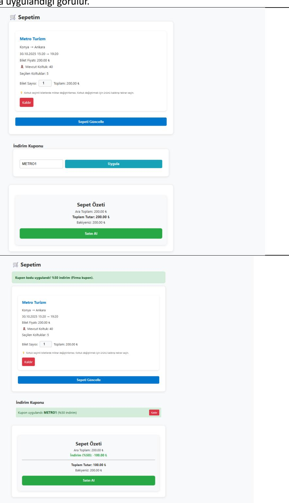
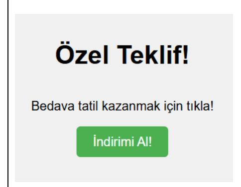

# **YAVUZLAR BİLET SATIN ALMA UYGULAMASI PENTEST RAPORU**

**İsim: Mustafa Talha DOĞAN**

**Takım: Yavuzlar 16**

**İncelediği Proje:<https://github.com/taro544/bilet-satin-alma>**

# **NOT:**

Pentest sürecinde uygulama analiz edilirken, uygulamanın temel Satın Al işlevinin kritik bir veritabanı hatası nedeniyle çalışmadığı tespit edilmiştir.

**Tespit Edilen Hata:** Satın alma sırasında hata oluştu: SQLSTATE[HY000]: General error: 1 table tickets has no column named company\_name

Hatanın Kök Nedeni: Analiz sonucunda, cart.php dosyasındaki checkout kod bloğunun tickets tablosuna yeni bir kayıt eklerken, veritabanı şemasında bulunmayan birden fazla sütuna veri yazmaya çalıştığı görülmüştür. Bu sütunlar: company\_name, departure\_city, arrival\_city, departure\_time ve arrival\_time'dır. Bu durum, uygulama kodu ile veritabanı şeması arasında bir uyumsuzluk olduğunu göstermektedir.

**Testin Devamlılığı İçin Uygulanan Eylem:** Raporun ilerleyen bölümlerinde belgelenen ödeme akışı zafiyetlerini ortaya çıkarabilmek ve uygulamanın tam bir güvenlik analizini tamamlayabilmek amacıyla, hedef sistemin veritabanı şemasına tarafımca müdahale edilmiştir. tickets tablosuna aşağıdaki SQL komutları uygulanarak eksik sütunlar eklenmiştir:

#### **SQL Komutları:**

ALTER TABLE tickets ADD COLUMN company\_name TEXT;

ALTER TABLE tickets ADD COLUMN departure\_city TEXT;

ALTER TABLE tickets ADD COLUMN arrival\_city TEXT;

ALTER TABLE tickets ADD COLUMN departure\_time DATETIME;

ALTER TABLE tickets ADD COLUMN arrival\_time DATETIME;

#### **UYARI:**

Bu belge, Yavuzlar Web Güvenliği Eğitim Programı kapsamında, tamamen eğitim ve öğrenim amacıyla hazırlanmış bir penetrasyon testi sonuç raporudur. İçerik, testin yapıldığı anı yansıtmakta olup, hatalar veya eksik değerlendirmeler içerebilir.

Bu rapor, Mustafa Talha DOĞAN (Yavuzlar 16) tarafından, [https://github.com/taro544/bilet](https://github.com/taro544/bilet-satin-alma)[satin-alma](https://github.com/taro544/bilet-satin-alma) adresinde kaynak kodları bulunan Bilet Satın Alma Platformu projesine karşı, görev tanımında belirtilen kurallar çerçevesinde yazılmıştır. Burada yapılanların herhangi bir yasal yükümlülüğü bulunmamaktadır.

# İçindekiler

| Yönetici Özeti                                                | 4  |
|---------------------------------------------------------------|----|
| Raporlama ve Metodoloji                                       | 5  |
| KAPSAM                                                        | 5  |
| TEST METODOLOJISI                                             | 5  |
| RİSK DEĞERLENDİRMESİ                                          | 5  |
| ZAFİYET BULGULARI VE DETAYLARI                                | 7  |
| BULGU-01                                                      | 7  |
| Açık erişilebilir SQLite veritabanı dosyası-database.sqlite   | 7  |
| BULGU-02                                                      | 9  |
| Kupon Doğrulama Eksikliğinden Kaynaklanan İş Mantığı Zafiyeti | 9  |
| BULGU-03                                                      | 12 |
| Siteler Arası İstek Sahteciliği (CSRF)                        | 12 |
| BULGU-04                                                      | 16 |
| Zavıf Kimlik Doğrulama                                        | 16 |

# **Yönetici Özeti**

Bu rapor, Yavuzlar Web Güvenliği Eğitim Programı kapsamında, github.com/taro544/biletsatin-alma adresinde kaynak kodları bulunan Bilet Satın Alma Platformu projesine yönelik 26.10.2025-28.10.2025 tarihleri arasında gerçekleştirilen beyaz kutu (white-box) penetrasyon testi bulgularını özetlemektedir.

Testler sonucunda, uygulamanın güvenlik olgunluğunun düşük seviyede olduğu ve canlı bir sistemde kullanılması durumunda kritik riskler barındırdığı tespit edilmiştir. Uygulamanın, modern web uygulamaları için temel kabul edilen çok sayıda güvenlik kontrolünden yoksun olduğu görülmüştür.

Tespit edilen zafiyetler, uygulamanın veri gizliliğini, bütünlüğünü ve finansal güvenilirliğini doğrudan tehdit etmektedir. Başlıca kritik bulgular şunlardır:

- Kritik Veri Sızıntısı (Bulgu-01): Uygulamanın tüm veritabanı (database.sqlite), internet üzerinden herhangi bir kimlik doğrulaması olmaksızın doğrudan indirilebilir durumdadır. Bu durum, tüm kullanıcıların ve yöneticilerin kişisel bilgilerinin ve parola karmalarının (hash) çalınmasına yol açmaktadır.
- Finansal Kayıp Riski (Bulgu-02): Fiyatlandırma mekanizmasında, saldırganların bir firmaya ait indirim kuponunu başka bir firma için kullanmasına olanak tanıyan kritik bir iş mantığı hatası bulunmaktadır. Bu, doğrudan gelir kaybına neden olabilir.
- Hesap Ele Geçirme ve Veri Manipülasyonu (Bulgu-03 & 04): Uygulama, Siteler Arası İstek Sahteciliği (CSRF) ve Kaba Kuvvet (Brute Force) saldırılarına karşı savunmasızdır. Bu zafiyetler birleştirildiğinde, kötü niyetli kişilerin:
  - o Kullanıcı ve firma hesaplarını ele geçirmesine,
  - o Firma sahiplerinin haberi olmadan seferlerini silmesine, fiyatlarını manipüle etmesine veya sahte seferler eklemesine,
  - o Kullanıcıların haberi olmadan adlarına bilet satın almasına olanak tanımaktadır.

Uygulamanın temel işlevlerini doğrudan etkileyen bu yüksek ve kritik seviyeli zafiyetlerin, sistemin güvenliğini sağlamak amacıyla öncelikli olarak giderilmesi şiddetle tavsiye edilmektedir.

# **Raporlama ve Metodoloji**

#### **KAPSAM**

Test, http://localhost:8080 üzerinde çalışan uygulamanın tamamını kapsamaktadır. DoS/DDoS saldırıları, sosyal mühendislik ve fiziksel güvenlik testleri kapsam dışıdır.

# **TEST METODOLOJİSİ**

Bu sızma testi, https://github.com/taro544/bilet-satin-alma adresindeki uygulamanın kaynak kodlarına erişim sağlanarak gerçekleştirilmiştir.

# **RİSK DEĞERLENDİRMESİ**

## **CVSS Nedir ve Nasıl Çalışır**

Bu rapordaki bulguların teknik ciddiyetini ölçmek için, endüstri standardı olan CVSS (Common Vulnerability Scoring System) esas alınmıştır. CVSS, her bir zafiyetin şiddetini 0.0 ile 10.0 arasında sayısal bir puanla ifade eden açık kaynaklı bir sistemdir. Bu puanlama, bir zafiyetin ne kadar kolay istismar edilebileceğini ve başarılı bir saldırının etkisini objektif bir şekilde ölçer.

Bu değerlendirmede CVSS v3.1 standardı kullanılmıştır. Hesaplamalar, [Chandanbn CVSS](https://chandanbn.github.io/cvss/)  [Calculator](https://chandanbn.github.io/cvss/) aracı üzerinden yapılmıştır. CVSS v3.1, her zafiyeti sekiz temel metrik (Attack Vector, Attack Complexity, Privileges Required, User Interaction, Scope, Confidentiality, Integrity, Availability) üzerinden değerlendirir ve bu metriklerin kombinasyonu sonucunda Base Score üretilir.

Balbix CVSS rehberine göre, bu puan yalnızca bir zafiyetin şiddet derecesini temsil eder; organizasyonel risk düzeyi ise sistemin önemi, varlık değeri, tehdit ortamı ve mevcut güvenlik önlemleri gibi çevresel faktörlere göre değişebilir. Dolayısıyla CVSS, teknik ciddiyet ölçümünde referans olarak alınmış; ancak nihai risk değerlendirmesi, sistem bağlamında yorumlanmıştır.

#### **Referanslar**

*[https://www.balbix.com/insights/understanding-cvss-](https://www.balbix.com/insights/understanding-cvss-scores/#:~:text=CVSS%20scoring%20assigns%20a%20number,characteristics%20may%20change%20over%20time)*

*[scores/#:~:text=CVSS%20scoring%20assigns%20a%20number,characteristics](https://www.balbix.com/insights/understanding-cvss-scores/#:~:text=CVSS%20scoring%20assigns%20a%20number,characteristics%20may%20change%20over%20time) [%20may%20change%20over%20time.](https://www.balbix.com/insights/understanding-cvss-scores/#:~:text=CVSS%20scoring%20assigns%20a%20number,characteristics%20may%20change%20over%20time)*

<https://chandanbn.github.io/cvss/>

#### **CVSS Puan Aralıkları ve Risk Seviyeleri**

| Seviye               | CVSS Puan Aralığı | Açıklama ve Proje Özelinde Örnekler                                                                                                                                                                                                                                                                                     |
|----------------------|-------------------|-------------------------------------------------------------------------------------------------------------------------------------------------------------------------------------------------------------------------------------------------------------------------------------------------------------------------|
| KRİTİK (Critical) | 9.0 – 10.0     | Sunucu Yanıyor Uzaktan, herhangi bir ayrıcalık veya kullanıcı etkileşimi gerektirmeden istismar edilebilen zafiyetlerdir. Sistemin tamamının ele geçirilmesine (RCE), veritabanı sızmasına veya geri dönülemez veri kaybına yol açabilir.                                        |
| YÜKSEK (High)     | 7.0 - 8.9      | Kilitli Kapıları Açmak Genellikle bir kullanıcının oturumunu ele geçirmeye veya başka bir kullanıcının/firmanın verilerini görmeye veya değiştirmeye (IDOR) olanak tanıyan zafiyetler.                                                                                                          |
| ORTA                 | 4.0 - 6.9      | Kapıyı Aralıklı Bırakmak Saldırganın işini kolaylaştıran, sisteme veya kullanıcılara dair bilgi sızdıran veya en iyi güvenlik pratiklerine (best practices) uyulmamasından kaynaklanan zafiyetler. Genellikle tek başına yıkıcı değildir ancak başka bir zafiyetle birleştirilerek (chained) kullanılır. |
| DÜŞÜK                | 0.1 - 3.9      | Kozmetik Güvenlik Etkisi düşük, istismarı çok zor olan veya uygulamanın doğrudan güvenliğini (gizlilik, bütünlük, erişilebilirlik) etkilemeyen yapılandırma eksiklikleri ve en iyi pratiklerin (best practices) ihlalleri.                                                                      |
| NONE                 | 0.0               | Aktif bir güvenlik riski oluşturmaz; yalnızca bilgilendirme amaçlıdır.                                                                                                                                                                                                                                               |

# **ZAFİYET BULGULARI VE DETAYLARI**

# **BULGU-01**

| Bulgu Adı                                                   |             |                                              |
|-------------------------------------------------------------|-------------|----------------------------------------------|
| Açık erişilebilir SQLite veritabanı dosyası-database.sqlite |             |                                              |
| Bulgu Kodu                                                  |             |                                              |
| DBS_DISCLOSURE_01                                           |             |                                              |
| Önem Derecesi                                               | CVSS        | Vektor String                                |
| High                                                        | 7.5 High | CVSS:3.1/AV:N/AC:L/PR:N/UI:N/S:U/C:H/I:N/A:N |
| Erişim Noktası                                              |             | Kullanıcı Profili                            |
| HTTP                                                        |             | Ziyaretçi (anonim)                           |

## **Bulgunun Tespit Edildiği Bileşen/Bileşenler**

<http://localhost:8080/db/database.sqlite>

web root içinde doğrudan erişilebilir SQLite dosyası

# **Zafiyetin Etkisi**

Confidentiality (C): High — Veritabanı dosyasının indirilmesiyle kullanıcı adları, e-posta adresleri, parola hash'leri, sipariş ve işlem kayıtları gibi hassas bilgiler açığa çıkabilir.

#### **Olası kötüye kullanım senaryoları:**

- Parola hash'lerinin elde edilmesi halinde offline brute-force/wordlist saldırılarıyla hesaplar ele geçirilebilir; zayıf hash/salt varsa risk artar.
- Elde edilen kullanıcı adları ile credential stuffing veya brute-force saldırıları yapılabilir. Bunun sonucu yetkisiz işlemler ve hesap ele geçirme olabilir.

**Integrity / Availability:** Bu tespit, dosyanın okunmasına izin verir; doğrudan veri değişikliği veya hizmet kesintisi yaratmaz. Ancak yukarıdaki ikincil senaryolar (ele geçirilmiş hesaplar) dolaylı integrity/availability etkilerine sebep olabilir.

# **Zaafiyetin Açıklaması**

Uygulama dizininde bulunan db/database.sqlite dosyasına web sunucusu üzerinden kimlik doğrulama olmadan erişilebilmektedir. Herhangi bir anonim kullanıcı tarayıcı veya curl/wget ile dosyayı indirip içeriğini inceleyebilir; bu da tüm veritabanı içeriğinin açığa çıkmasına neden olur.

### **Tetiklenme / Reproduce Adımları**

Tarayıcıda http://localhost:8080/db/database.sqlite adresine git. Dosya doğrudan indirilecektir. Veya terminalden curl -o database.sqlite http://<hedefhost>:8080/db/ database.sqlite komutunu çalıştırırsan dosya indirilecektir.

# **Çözüm Önerileri**

**Dosyaları Web Kök Dizininden Taşıma:** Veri tabanı gibi hassas dosyalar asla web sunucusunun doğrudan erişebileceği bir dizinde barındırılmamalıdır. Bu dosyalar, web kök dizininin bir üst seviyesine proje köküne taşınmalıdır. PHP betikleri bu dosyalara include '../config.php' gibi dosya sistemi yollarıyla erişmeye devam edebilir, ancak dışarıdan bir kullanıcı URL ile erişemez.

**Sunucu Yapılandırması ile Erişimi Engelleme:** Eğer dosya yapısını değiştirmek mimari nedenlerle mümkün değilse, web sunucusu (örn: Apache) bu dosyalara ve dizinlere yapılan tüm web isteklerini engelleyecek şekilde yapılandırılmalıdır. Bu, projenin ana dizinine eklenecek bir .htaccess dosyası ile sağlanabilir

## **Referanslar**

*<https://cwe.mitre.org/data/definitions/219.html>*

*<https://www.php.net/manual/en/security.php>*

# **BULGU-02**

| Bulgu Adı                                                     |           |                                              |  |
|---------------------------------------------------------------|-----------|----------------------------------------------|--|
| Kupon Doğrulama Eksikliğinden Kaynaklanan İş Mantığı Zafiyeti |           |                                              |  |
| Bulgu Kodu                                                    |           |                                              |  |
| LOGIC_VOUCHER_01                                              |           |                                              |  |
| Önem Derecesi                                                 | CVSS      | Vektor String                                |  |
| Medium                                                        | 4.3Medium | CVSS:3.1/AV:N/AC:L/PR:L/UI:N/S:U/C:N/I:L/A:N |  |
| Erişim Noktası                                                |           | Kullanıcı Profili                            |  |
| HTTP                                                          |           | User (Kullanıcı)                          |  |

### **Bulgunun Tespit Edildiği Bileşen/Bileşenler**

<http://localhost:5005/cart.php>

## **Zafiyetin Etkisi**

**Integrity (I): High** — Zafiyet, uygulamanın temel iş mantığını fiyatlandırmayı manipüle eder. Saldırgan, normalde yetkisi olmayan indirimleri sepetine uygulayarak siparişin son fiyatını yasa dışı bir şekilde değiştirebilir.

#### **Olası kötüye kullanım senaryoları:**

• Sadece belirli bir firmaya (A Firması) tanımlanmış yüksek değerli bir indirim kuponu, bu zafiyet kullanılarak sistemdeki diğer tüm firmalardan (B, C, D Firmaları) bilet almak için kullanılabilir.

#### **Zaafiyetin Açıklaması**

Uygulamanın sepet yönetim mantığı, bir kupon uygulandıktan sonra sepet içeriği değiştiğinde, uygulanan kuponun yeni sepet içeriğiyle yeniden kontrol edilmesi gerçekleştirmemektedir.

Kuponun geçerliliği, sepete eklendiği *an* bir kez kontrol edilmekte, ancak sepet güncellendiğinde bu onaylanmış indirim durumu sepetten kaldırılmamaktadır. Bu durum, bir firmaya (A Firması) ait kuponun, o firma sepetten çıkarıldıktan sonra bile B Firması'nın biletine uygulanmasına olanak tanır. Bu, CWE-840: Business Logic Vulnerability (İş Mantığı Zafiyeti) olarak sınıflandırılır.

## **Tetiklenme / Reproduce Adımları**

Oturum açmış bir kullanıcı olarak, A Firması'na ait bir bileti sepete ekle.

Sepet sayfasında (cart.php), sadece A Firması'na özel olan bir kupon kodunu gir ve uygula.

İndirimin sepete başarıyla uygulandığı gözlemle.

Şimdi, A Firması'na ait bileti sepetten kaldır.

B Firması'na ait bir bileti sepete ekle.

Sepet özetini kontrol et. Bir önceki kupondan kaynaklanan indirimin hala aktif olduğu ve B Firması'nın bilet fiyatına uygulandığı görülür.

| Sepetim                                                                                                                                 |        |
|-----------------------------------------------------------------------------------------------------------------------------------------|--------|
|                                                                                                                                         |        |
| Varan Turizm                                                                                                                            |        |
| istanbul → Ankara                                                                                                                       |        |
| 30.10.2025 23:07 → 09:06                                                                                                                |        |
| Bilet Fiyatı: 150.00 ₺                                                                                                                  |        |
| Mevcut Koltuk: 40                                                                                                                       |        |
| Seçilen Koltuklar: 38                                                                                                                   |        |
| Bilet Sayısı: 1 Toplam: 150.00 €                                                                                                        |        |
| 💡 Koltuk seçimli biletlerde miktar değiştirilemez. Koltuk değiştirmek için ürünü kaldırıp tekrar seçin.                                 |        |
| Kaldır                                                                                                                                  |        |
| Kaluli                                                                                                                                  |        |
|                                                                                                                                         |        |
|                                                                                                                                         |        |
| Sepeti Güncelle                                                                                                                         |        |
| Sepeti Güncelle                                                                                                                         |        |
| Sepeti Güncelle                                                                                                                         |        |
|                                                                                                                                         |        |
| Sepeti Güncelle Îndirim Kuponu                                                                                                       |        |
| İndirim Kuponu                                                                                                                          | Kalde  |
|                                                                                                                                         | Kalde  |
| Índirim Kuponu                                                                                                                          | Kalde  |
| Índirim Kuponu                                                                                                                          | Kalder |
| İndirim Kuponu  Kupon uygulandı: METRO1 (%50 indirim)                                                                                   | Kadr   |
| İndirim Kuponu  Kupon uygulandı: METRO1 (%50 indirim)  Sepet Özeti                                                                      | Kalder |
| İndirim Kuponu  Kupon uygulandı: METRO1 (%50 indirim)  Sepet Özeti  Ara Toplam: 150.00 &                                                | Kalder |
| İndirim Kuponu  Kupon uygulandı: METRO1 (%50 indirim)  Sepet Özeti                                                                      | Kalder |
| indirim Kuponu  Kupon uygulandı: METRO1 (%50 indirim)  Sepet Özeti  Ara Toplam: 150.00 & indirim (%50): -75.00 &                        | Kalde  |
| İndirim Kuponu  Kupon uygulandı: METRO1 (%50 indirim)  Sepet Özeti  Ara Toplam: 150.00 &                                                | Kalde  |
| indirim Kuponu  Kupon uygulandı: METRO1 (%50 indirim)  Sepet Özeti  Ara Toplam: 150.00 & indirim (%50): -75.00 &  Toplam Tutar: 75.00 & | Kalde  |

# **Çözüm Önerileri**

cart.php (veya sepeti yöneten herhangi bir sunucu tarafı betik), sepete her ürün eklendiğinde VEYA çıkarıldığında çalışacak bir fonksiyon içermelidir.

Bu fonksiyon, sepette halihazırda uygulanmış bir kupon (\$\_SESSION['coupon'] gibi) varsa, bu kuponun mevcut sepet içeriğiyle (tutar, firma, sefer ID'si vb.) olan uygunluğunu veritabanından yeniden doğrulamalıdır.

Eğer kupon artık sepetle uyumlu değilse, kupon otomatik olarak sepetten (session'dan) kaldırılmalı ve kullanıcıya Sepet içeriğiniz değiştiği için X kuponu kaldırıldı. gibi bir mesaj gösterilmelidir.

#### **Referanslar**

*https://cwe.mitre.org/data/definitions/840.html*

# **BULGU-03**

| Bulgu Adı                              |             |                                                                         |
|----------------------------------------|-------------|-------------------------------------------------------------------------|
| Siteler Arası İstek Sahteciliği (CSRF) |             |                                                                         |
| Bulgu Kodu                             |             |                                                                         |
| CSRF_ALL_FORMS_01                      |             |                                                                         |
| Önem Derecesi                          | CVSS        | Vektor String                                                           |
| High                                   | 8.1 High | CVSS:3.1/AV:N/AC:L/PR:N/UI:R/S:U/C:N/I:H/A:H                            |
| Erişim Noktası                         |             | Kullanıcı Profili                                                       |
| HTTP                                   |             | Oturumu açık user— Oturumu açık company/ Oturumu açık admin |

| Bulgunun Tespit Edildiği Bileşen/Bileşenler           |  |  |
|-------------------------------------------------------|--|--|
| http://localhost:5005/cart.php                        |  |  |
| http://localhost:8080/cancel_ticket.php               |  |  |
| http://localhost:8080/trip.php                        |  |  |
| http://localhost:8080/edit_trip.php                   |  |  |
| http://localhost:8080/new_trip.php                    |  |  |
| http://localhost:8080/delete_trip.php                 |  |  |
| http://localhost:8080/admin/manage_companies.php      |  |  |
| http://localhost:8080/admin/manage_coupons.php        |  |  |
| http://localhost:8080/admin/add_company.php           |  |  |
| http://localhost:8080/admin/manage_company_admins.php |  |  |
| http://localhost:8080/admin/manage_users.php          |  |  |
| http://localhost:8080/admin/edit_company.php          |  |  |

## **Zafiyetin Etkisi**

**Integrity (I): High —** Saldırgan, kurbanın yetkileri dahilinde uygulamadaki hemen hemen her veriyi (sefer bilgileri, firma detayları, kuponlar, kullanıcı hesapları) kurbanın haberi olmadan değiştirebilir veya silebilir. Fiyatları manipüle edebilir, sahte içerik (firma, admin, kupon) ekleyebilir.

**Availability (A): High —** Saldırgan, kritik verilerin (tüm firmalar, tüm seferler) silinmesini tetikleyerek uygulamanın veya belirli bölümlerinin kullanılamaz hale gelmesine neden olabilir. Örneğin, tüm firmaların silinmesi, platformun işlevsiz kalmasına yol açar.

#### **Olası kötüye kullanım senaryoları:**

- Oturumu açık bir admin kandırılarak sistemdeki tüm firmaların silinmesi.
- Oturumu açık bir admin kandırılarak meşru bir firmaya saldırganın kontrolünde yeni bir company admini eklenmesi (Yetki Yükseltme).
- Oturumu açık bir company admini kandırılarak tüm seferlerinin silinmesi veya fiyatlarının "1 TL" olarak güncellenmesi.
- Oturumu açık bir company admini kandırılarak firmaya ait tüm indirim kuponlarının silinmesi veya "%100 indirimli" sahte kuponlar eklenmesi.
- Oturumu açık bir user kandırılarak sepetindeki ürünlerin haberi olmadan satın alınması veya tüm biletlerinin iptal edilerek para iadesi aldırılması.

## **Zaafiyetin Açıklaması**

Uygulama genelinde, kullanıcının oturumunda durum değişikliğine neden olan (veri ekleme, silme, güncelleme vb.) POST isteklerini işleyen formlar, bu isteklerin gerçekten kullanıcının o anki oturumu sırasında bilinçli olarak mı yapıldığını yoksa harici bir kaynaktan mı tetiklendiğini doğrulamak için kullanılan Anti-CSRF token mekanizmasını içermemektedir. Sunucu tarafı kodları, bir isteğin meşruluğunu sadece istekle birlikte gelen oturum çerezinin (örn: PHPSESSID) geçerliliğine bakarak kontrol etmektedir. Bu durum, bir saldırganın, oturumu açık bir kurbanı kendi hazırladığı zararlı bir web sayfasına yönlendirerek, kurbanın tarayıcısının arka planda bu savunmasız formlara (kurbanın oturum çereziyle birlikte) otomatik olarak istek göndermesini sağlamasına olanak tanır. Sunucu, istekle birlikte geçerli oturum çerezini gördüğü için, isteğin kaynağını sorgulamadan işlemi kurban adına gerçekleştirir.

# **Tetiklenme / Reproduce Adımları**

User hesabıyla http://localhost:8080 adresinde oturum açılır.

Sepete bir bilet eklenir ancak satın alma işlemi tamamlanmaz.

Saldırgan kötü niyetli bir içerik üretir.

Saldırgan, kurbanı herhangi bir yöntemle (e-posta, sosyal medya mesajı, başka bir web sitesindeki link/resim/reklam) kötü niyetli bir içeriğe tıklamaya veya o içeriğin yüklenmesini sağlamaya ikna eder. Aşağıdaki örnekteki gibi.

kaynak kodu temel olarak şu kısım önemli: <form name="csrfForm" action="http://localhost :8080/cart.php" method="POST" target= "hiddenFrame" > <input type="hidden" name="checkout" value="" /> </form>

Eğer kullanıcı butona tıklarsa gizli form otomatik olarak kurbanın tarayıcısından http://localhost:8080/cart.php adresine checkout= parametresiyle gönderilir.

Kurban, cart.php sayfasına geri dönüp yenilediğinde "Satın alma başarılı!" mesajını ve sepetinin boşaldığını görür. account.php sayfasında ise bakiyesinin düştüğü ve biletin hesabına eklendiği doğrulanır. Kurban, sadece "Tebrikler" diyen bir sayfaya tıklayarak haberi olmadan para harcamış olur.

## **Çözüm Önerileri**

Tüm state-changing (durum değiştiren - Ekleme, Silme, Güncelleme, Satın Alma) formlara Anti-CSRF Token (Synchronizer Token Pattern) koruması eklenmelidir.

#### **Token Oluşturma**

Kullanıcı oturum açtığında, config.php veya merkezi bir betikte, kriptografik olarak güvenli, benzersiz ve tahmin edilemez bir token üretilmelidir. Bu token, \$\_SESSION['csrf\_token'] içinde saklanmalıdır.

#### **Örnek**

if (empty(\$\_SESSION['csrf\_token'])) { \$\_SESSION['csrf\_token'] = bin2hex(random\_bytes(32)); }

#### **Token'ı Forma Ekleme:**

Değişiklik yapan tüm HTML formlarına bu token gizli bir input alanı olarak eklenmelidir.

#### **Örnek**

<form action="delete\_trip.php" method="POST"> <input type="hidden" name="csrf\_token" value="<?php echo htmlspecialchars(\$\_SESSION['csrf\_token']); ?>"> <button type="submit">Seferi Sil</button> </form>

#### **Token'ı Doğrulama**

Sunucu tarafında POST isteği işlenmeden *hemen önce*, formdan gelen token ile session'da saklanan token'ın eşleşip eşleşmediği kontrol edilmelidir.

#### **Referanslar**

*<https://cwe.mitre.org/data/definitions/352.html>*

*[https://cheatsheetseries.owasp.org/cheatsheets/Cross-](https://cheatsheetseries.owasp.org/cheatsheets/Cross-Site_Request_Forgery_Prevention_Cheat_Sheet.html)*

*[Site\\_Request\\_Forgery\\_Prevention\\_Cheat\\_Sheet.html](https://cheatsheetseries.owasp.org/cheatsheets/Cross-Site_Request_Forgery_Prevention_Cheat_Sheet.html)*

| Bulgu Adı              |                 |                                              |  |
|------------------------|-----------------|----------------------------------------------|--|
| Zayıf Kimlik Doğrulama |                 |                                              |  |
| Bulgu Kodu             |                 |                                              |  |
| AUTHN_BRUTEFORCE_01    |                 |                                              |  |
| Önem Derecesi          | CVSS            | Vektor String                                |  |
| Critical               | 9.8 Critical | CVSS:3.1/AV:N/AC:L/PR:N/UI:N/S:U/C:H/I:H/A:H |  |
| Erişim Noktası         |                 | Kullanıcı Profili                            |  |
| HTTP                   |                 | Ziyaretçi(Anonim)                            |  |

#### **Bulgunun Tespit Edildiği Bileşen/Bileşenler**

<http://localhost:8080/login.php>

#### **Zafiyetin Etkisi**

Bu zafiyet, uygulamanın kimlik doğrulama mekanizmasındaki temel bir eksiklikten kaynaklanır ve sistemin tamamen ele geçirilmesine yol açabilir.

Confidentiality (H), Integrity (H), Availability (H): Zafiyet, saldırganın admin@example.com gibi bilinen bir yönetici veya firma hesabını hedef alarak parola kırma denemesi yapmasına olanak tanır. Başarılı bir saldırı sonucunda:

- Sistem Ele Geçirilir: Saldırgan, yönetici yetkileriyle oturum açar.
- Tüm Veriler Sızdırılır: Tüm kullanıcıların kişisel bilgileri, bilet geçmişleri ve firma bilgileri çalınabilir.
- Tüm Veriler Manipüle Edilebilir: Sefer fiyatları değiştirilebilir, biletler silinebilir, sahte yönetici hesapları oluşturulabilir.
- Sistem Durdurulabilir: Tüm verilerin (kullanıcılar, seferler) silinmesi yoluyla uygulama tüm kullanıcılar için erişilemez hale getirilebilir.

## **Zaafiyetin Açıklaması**

Login.php betiği, bir kullanıcının (veya bir IP adresinin) belirli bir zaman diliminde kaç kez hatalı parola denemesi yaptığını kısıtlayan bir mekanizmaya veya hesap kilitleme politikasına sahip değildir.

Bir saldırgan, admin@example.com gibi bilinen bir hesaba karşı, yaygın şifre listeleri kullanarak saniyede binlerce otomatik parola denemesi (Brute Force Saldırısı) gerçekleştirebilir. PHP'nin password\_verify fonksiyonu güvenli bir karma (hash) karşılaştırması yapsa da, sunucu tarafında bir deneme kısıtlaması olmadığından bu tür otomatik saldırılara karşı tek başına bir koruma sağlamaz.

## **Tetiklenme / Reproduce Adımları**

Bir saldırgan, hedef olarak admin@example.com gibi geçerli bir kullanıcı adı belirler. Kalideki ffuf komutu ile hazır bir seclist olan rockyou.txt kullanılarak brüte force yapılır.

#### **Komut**

ffuf -u http://192.168.84.1:8080/login.php -w /usr/share/wordlists/rockyou.txt -X POST -d "email=admin%40admin.com&password=FUZZ" -H "Content-Type: application/x-wwwform-urlencoded" -fs 721

Sunucudan hiçbir kısıtlama gelmediği için saldırı, doğru parola bulunana kadar kesintisiz devam eder.

Eğer doğru parola bulunursa ffuf toolu ekrana şifreyi basar.

# **Çözüm Önerileri**

Uygulamaya kademeli bir savunma mekanizması eklenmelidir.

#### **Hesap Kilitleme (Account Lockout)**

Veritabanındaki users tablosuna failed\_login\_attempts (INT) ve last\_failed\_login (TIMESTAMP) gibi iki yeni sütun eklenmelidir.

- Kullanıcı şifreyi yanlış girdiğinde failed\_login\_attempts sayacı 1 artırılır.
- Sayac 5'e (veya 10'a) ulaştığında, hesap kilitlenmeli ve kullanıcıya parola sıfırlama epostası gönderilmelidir. Bu, hedefli saldırıları tamamen durdurur.

#### **Hız Kısıtlama (Rate Limiting)**

Belirli bir IP adresinden, kısa bir süre içinde (örn. 1 dakika) login.php'ye gelen POST isteklerinin sayısı sınırlandırılmalıdır.

• Örn: Bir IP, 1 dakika içinde 20'den fazla hatalı giriş denemesi yaparsa, o IP 15 dakika boyunca engellenmeli ve HTTP 429 Too Many Requests yanıtı döndürülmelidir. Bu, yaygın (noisy) brute-force saldırılarını yavaşlatır.

**CAPTCHA:** 3 hatalı giriş denemesinden sonra, kullanıcıya bir CAPTCHA gösterilmelidir. Bu, otomatik bot saldırılarını büyük ölçüde engeller.

## **Referanslar**

*<https://cwe.mitre.org/data/definitions/307.html>*

*[https://owasp.org/Top10/A07\\_2021-](https://owasp.org/Top10/A07_2021-Identification_and_Authentication_Failures/)*

*[Identification\\_and\\_Authentication\\_Failures/](https://owasp.org/Top10/A07_2021-Identification_and_Authentication_Failures/)*