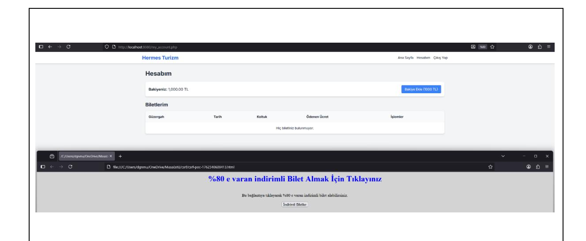
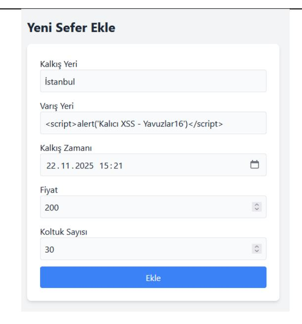
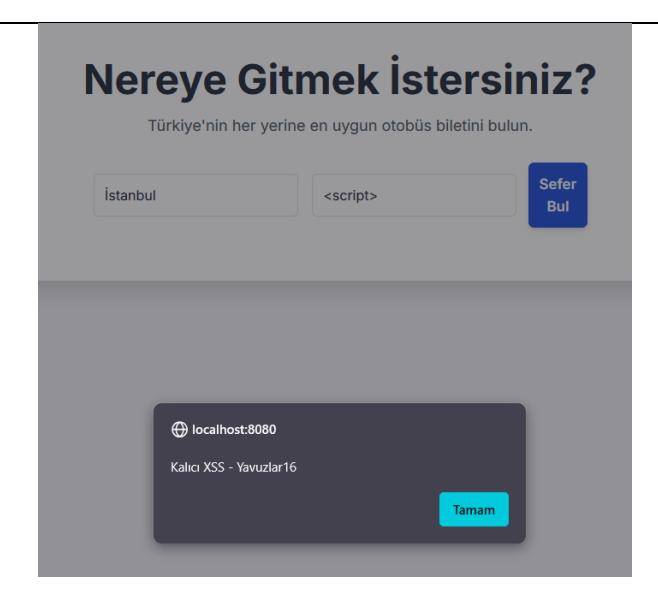
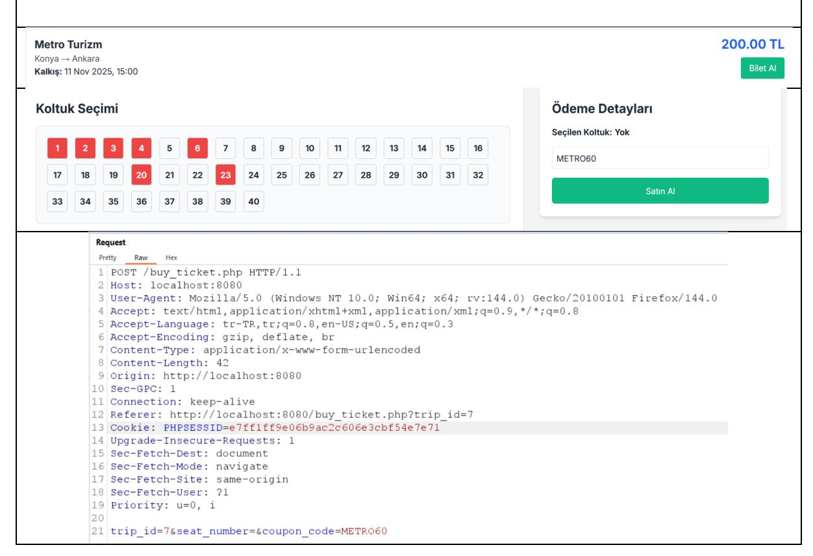

# **YAVUZLAR BİLET SATIN ALMA UYGULAMASI PENTEST RAPORU**

**İsim: Mustafa Talha DOĞAN**

**Takım: Yavuzlar 16**

**Proje:** <https://github.com/MuhittinYilmazer/bilet-satin-alma>

## **UYARI:**

Bu belge, Yavuzlar Web Güvenliği Eğitim Programı kapsamında, tamamen eğitim ve öğrenim amacıyla hazırlanmış bir penetrasyon testi sonuç raporudur. İçerik, testin yapıldığı anı yansıtmakta olup, hatalar veya eksik değerlendirmeler içerebilir.

Bu rapor, Mustafa Talha DOĞAN tarafından, [https://github.com/MuhittinYilmazer/bilet-satin](https://github.com/MuhittinYilmazer/bilet-satin-alma)[alma](https://github.com/MuhittinYilmazer/bilet-satin-alma) adresinde kaynak kodları bulunan Bilet Satın Alma Platformu projesine karşı, görev tanımında belirtilen kurallar çerçevesinde yazılmıştır. Burada yapılanların herhangi bir yasal yükümlülüğü bulunmamaktadır.

# İçindekiler

| YÖNETİCİ ÖZETİ3                                                   |  |
|-------------------------------------------------------------------|--|
| RAPORLAMA VE METODOLOJİ4                                          |  |
| KAPSAM<br>4                                                       |  |
| TEST METODOLOJİSİ4                                                |  |
| RİSK DEĞERLENDİRMESİ4                                             |  |
| ZAFİYET BULGULARI VE DETAYLARI<br>6                               |  |
| BULGU-016                                                         |  |
| Açık erişilebilir veritabanı dosyası-database.sqlite6             |  |
| BULGU-028                                                         |  |
| Şifrelerin Düz Metin Olarak Saklanması-<br>Cryptographic Failure8 |  |
| BULGU-0310                                                        |  |
| Siteler Arası İstek Sahteciliği (CSRF)10                          |  |
| BULGU-0414                                                        |  |
| Siteler Arası Betik Çalıştırma (XSS)<br>14                        |  |
| BULGU-0518                                                        |  |
| Kupon Kullanım Mantığında<br>Race Condition18                     |  |

# **YÖNETİCİ ÖZETİ**

<span id="page-2-0"></span>Bu rapor, Yavuzlar Web Güvenliği Eğitim Programı kapsamında, <https://github.com/MuhittinYilmazer/bilet-satin-alma>adresinde kaynak kodları bulunan Bilet Satın Alma Platformu projesine yönelik 05.11.2025-06.11.2025 tarihleri arasında gerçekleştirilen beyaz kutu (white-box) penetrasyon testi bulgularını özetlemektedir.

Testler sonucunda, uygulamanın güvenlik durumunun kritik derecede düşük seviyede olduğu ve canlı bir sistemde kullanılması durumunda ciddi riskler barındırdığı tespit edilmiştir. Uygulamanın, modern web uygulamaları için temel kabul edilen çok sayıda güvenlik kontrolünden yoksun olduğu görülmüştür.

Tespit edilen zafiyetler, uygulamanın veri gizliliğini, bütünlüğünü ve finansal güvenilirliğini doğrudan tehdit etmektedir. Başlıca kritik bulgular şunlardır:

- Sistemin Tamamının Anında Ele Geçirilmesi (Bulgu-01 & 02): Uygulamanın tüm veritabanı ,internet üzerinden herhangi bir kimlik doğrulaması olmaksızın doğrudan indirilebilir durumdadır. Bu durum, Kriptografik Hatalar zafiyeti ile birleştiğinde, Süper Admin dahil tüm kullanıcıların parolalarının düz metin olarak ele geçirilmesine ve sistemin tamamının anında ele geçirilmesine yol açmaktadır.
- Doğrudan Finansal Kayıp (Bulgu-05): Kupon kısmında bulunan Race Condition zafiyeti, saldırganların tek kullanımlık bir kuponu, sunucuya eşzamanlı istekler göndererek sınırsız sayıda kullanmasına olanak tanımaktadır. Bu, doğrudan gelir kaybına neden olan kritik bir hatadır.
- Hesap Ele Geçirme ve Veri Manipülasyonu (Bulgu-03 & 04): Uygulama, hem Siteler Arası İstek Sahteciliği (CSRF) hem de XSS zafiyetlerine karşı tüm yetki seviyelerinde tamamen savunmasızdır. Bu zafiyetler kötüye kullanılarak:
  - o Bir Süper Admin'in oturum çerezini (cookie) çalarak veya haberi olmadan istek göndermesini sağlayarak tüm firmaları, seferleri ve biletleri silmesine,
  - o Bir Firma Admin'in haberi olmadan sefer fiyatlarını manipüle etmesine veya sahte seferler eklemesine,
  - o Normal bir kullanıcının haberi olmadan biletlerini iptal ettirmesine olanak tanımaktadır.

Uygulamanın temel işlevlerini doğrudan etkileyen bu yüksek ve kritik seviyeli zafiyetlerin, sistemin güvenliğini sağlamak amacıyla öncelikli olarak giderilmesi tavsiye edilmektedir.

# **RAPORLAMA VE METODOLOJİ**

## <span id="page-3-1"></span><span id="page-3-0"></span>**KAPSAM**

Test, http://localhost:8080 üzerinde çalışan uygulamanın tamamını kapsamaktadır. DoS/DDoS saldırıları, sosyal mühendislik ve fiziksel güvenlik testleri kapsam dışıdır.

## <span id="page-3-2"></span>**TEST METODOLOJİSİ**

Bu sızma testi, <https://github.com/MuhittinYilmazer/bilet-satin-alma> adresindeki uygulamanın kaynak kodlarına erişim sağlanarak gerçekleştirilmiştir.

# **RİSK DEĞERLENDİRMESİ**

## <span id="page-3-3"></span>**CVSS Nedir ve Nasıl Çalışır**

Bu rapordaki bulguların teknik ciddiyetini ölçmek için, endüstri standardı olan CVSS (Common Vulnerability Scoring System) esas alınmıştır. CVSS, her bir zafiyetin şiddetini 0.0 ile 10.0 arasında sayısal bir puanla ifade eden açık kaynaklı bir sistemdir. Bu puanlama, bir zafiyetin ne kadar kolay istismar edilebileceğini ve başarılı bir saldırının etkisini objektif bir şekilde ölçer.

Bu değerlendirmede CVSS v3.1 standardı kullanılmıştır. Hesaplamalar, [Chandanbn CVSS](https://chandanbn.github.io/cvss/)  [Calculator](https://chandanbn.github.io/cvss/) aracı üzerinden yapılmıştır. CVSS v3.1, her zafiyeti sekiz temel metrik (Attack Vector, Attack Complexity, Privileges Required, User Interaction, Scope, Confidentiality, Integrity, Availability) üzerinden değerlendirir ve bu metriklerin kombinasyonu sonucunda Base Score üretilir.

Balbix CVSS rehberine göre, bu puan yalnızca bir zafiyetin şiddet derecesini temsil eder; organizasyonel risk düzeyi ise sistemin önemi, varlık değeri, tehdit ortamı ve mevcut güvenlik önlemleri gibi çevresel faktörlere göre değişebilir. Dolayısıyla CVSS, teknik ciddiyet ölçümünde referans olarak alınmış; ancak nihai risk değerlendirmesi, sistem bağlamında yorumlanmıştır.

## **Referanslar**

*[https://www.balbix.com/insights/understanding-cvss-](https://www.balbix.com/insights/understanding-cvss-scores/#:~:text=CVSS%20scoring%20assigns%20a%20number,characteristics%20may%20change%20over%20time)*

*[scores/#:~:text=CVSS%20scoring%20assigns%20a%20number,characteristics%20may%20c](https://www.balbix.com/insights/understanding-cvss-scores/#:~:text=CVSS%20scoring%20assigns%20a%20number,characteristics%20may%20change%20over%20time) [hange%20over%20time.](https://www.balbix.com/insights/understanding-cvss-scores/#:~:text=CVSS%20scoring%20assigns%20a%20number,characteristics%20may%20change%20over%20time)*

<https://chandanbn.github.io/cvss/>

#### **CVSS Puan Aralıkları ve Risk Seviyeleri**

| Seviye               | CVSS Puan<br>Aralığı | Açıklama ve Proje Özelinde Örnekler                                                                                                                                                                                                                                                       |  |
|----------------------|----------------------|-------------------------------------------------------------------------------------------------------------------------------------------------------------------------------------------------------------------------------------------------------------------------------------------|--|
| KRİTİK<br>(Critical) | 9.0 –<br>10.0        | Sunucu Yanıyor<br>Uzaktan, herhangi bir ayrıcalık veya kullanıcı etkileşimi<br>gerektirmeden istismar edilebilen zafiyetlerdir. Sistemin tamamının<br>ele geçirilmesine (RCE), veritabanı sızmasına veya geri dönülemez veri<br>kaybına yol açabilir.                                     |  |
| YÜKSEK<br>(High)     | 7.0 -<br>8.9         | Kilitli Kapıları Açmak<br>Genellikle bir kullanıcının oturumunu ele<br>geçirmeye veya başka bir kullanıcının/firmanın verilerini görmeye veya<br>değiştirmeye (IDOR) olanak tanıyan zafiyetler.                                                                                           |  |
| ORTA                 | 4.0 -<br>6.9         | Kapıyı Aralıklı Bırakmak<br>Saldırganın işini kolaylaştıran, sisteme veya<br>kullanıcılara dair bilgi sızdıran veya en iyi güvenlik pratiklerine<br>uyulmamasından kaynaklanan zafiyetler. Genellikle tek başına yıkıcı<br>değildir ancak başka bir zafiyetle birleştirilerek kullanılır. |  |
| DÜŞÜK                | 0.1 -<br>3.9         | Kozmetik<br>Güvenlik<br>Etkisi<br>düşük,<br>istismarı<br>çok<br>zor<br>olan<br>veya<br>uygulamanın doğrudan güvenliğini (gizlilik, bütünlük, erişilebilirlik)<br>etkilemeyen yapılandırma eksiklikleri ve en iyi pratiklerin ihlalleri.                                                   |  |
| NONE                 | 0.0                  | Aktif bir güvenlik riski oluşturmaz; yalnızca bilgilendirme amaçlıdır.                                                                                                                                                                                                                    |  |

# **ZAFİYET BULGULARI VE DETAYLARI**

## <span id="page-5-1"></span><span id="page-5-0"></span>**BULGU-01**

<span id="page-5-2"></span>

| Bulgu Adı                                            |             |                                              |
|------------------------------------------------------|-------------|----------------------------------------------|
| Açık erişilebilir veritabanı dosyası-database.sqlite |             |                                              |
| Bulgu Kodu                                           |             |                                              |
| DBS_DISCLOSURE_01                                    |             |                                              |
| Önem Derecesi                                        | CVSS        | Vektor String                                |
| High                                                 | 7.5<br>High | CVSS:3.1/AV:N/AC:L/PR:N/UI:N/S:U/C:H/I:N/A:N |
| Erişim Noktası                                       |             | Kullanıcı Profili                            |
| HTTP                                                 |             | Ziyaretçi (anonim)                           |

## **Bulgunun Tespit Edildiği Bileşen/Bileşenler**

<http://localhost:8080/database/database.sqlite>

| Zafiyetin Etkisi              |                                                                                                                                                                                                                                                                                                                                                                                          |  |  |
|-------------------------------|------------------------------------------------------------------------------------------------------------------------------------------------------------------------------------------------------------------------------------------------------------------------------------------------------------------------------------------------------------------------------------------|--|--|
| Confidentiality<br>(C): High: | Veritabanı<br>dosyasının indirilmesiyle kullanıcı adları, e-posta adresleri,<br>siparişler ve işlem kayıtları gibi tüm hassas bilgiler açığa çıkabilir. Bu zafiyet,<br>rapordaki "BULGU-02: Kriptografik Hatalar" bulgusu ile birleştiğinde, tüm<br>kullanıcı şifrelerinin de düz metin olarak ele geçirilmesine olanak tanır ve<br>projenin genel riskini<br>Kritik seviyeye yükseltir. |  |  |
| Integrity:<br>Availability:   | Bu tespit, dosyanın okunmasına izin verir; doğrudan veri değişikliği veya<br>hizmet kesintisi yaratmaz. Ancak aşağıdaki<br>ikincil senaryolar ele geçirilmiş<br>hesaplar dolaylı integrity/availability etkilerine sebep olabilir.                                                                                                                                                       |  |  |

#### **Olası kötüye kullanım senaryoları:**

- Parola hash'lerinin elde edilmesi halinde offline brute-force/wordlist saldırılarıyla hesaplar ele geçirilebilir; zayıf hash/salt varsa risk artar.
- Elde edilen kullanıcı adları ile credential stuffing veya brute-force saldırıları yapılabilir. Bunun sonucu yetkisiz işlemler ve hesap ele geçirme olabilir.
- Bu projede şifreler hashlenmediği için direkt olarak kullanıcılar admin hesabıyla giriş yaparak tüm seferleri veya tüm kullanıcıları silip siteyi kullanılamaz hale getirebilir.

## **Zaafiyetin Açıklaması**

Uygulama dizininde bulunan database/database.sqlite dosyasına web sunucusu üzerinden kimlik doğrulama olmadan erişilebilmektedir. Herhangi bir anonim kullanıcı tarayıcı veya curl/wget ile dosyayı indirip içeriğini inceleyebilir; bu da tüm veritabanı içeriğinin açığa çıkmasına neden olur.

## **Tetiklenme / Reproduce Adımları**

Tarayıcıda http://localhost:8080/database/database.sqlite adresine git. Dosya doğrudan indirilecektir. Veya terminalden curl -o database.sqlite http://<ip adres>:8080/database/ database.sqlite komutunu çalıştırırsan dosya indirilecektir.

## **Çözüm Önerileri**

**Dosyaları Web Kök Dizininden Taşıma:** Veri tabanı gibi hassas dosyalar asla web sunucusunun doğrudan erişebileceği bir dizinde barındırılmamalıdır. Bu dosyalar, web kök dizininin bir üst seviyesine proje köküne taşınmalıdır. PHP betikleri bu dosyalara include '../config.php' gibi dosya sistemi yollarıyla erişmeye devam edebilir, ancak dışarıdan bir kullanıcı URL ile erişemez.

**Sunucu Yapılandırması ile Erişimi Engelleme:** Eğer dosya yapısını değiştirmek mimari nedenlerle mümkün değilse, web sunucusu bu dosyalara ve dizinlere yapılan tüm web isteklerini engelleyecek şekilde yapılandırılmalıdır. Bu, projenin ana dizinine eklenecek bir .htaccess dosyası ile sağlanabilir

#### **Referanslar**

*<https://cwe.mitre.org/data/definitions/219.html> <https://www.php.net/manual/en/security.php>*

<span id="page-7-1"></span><span id="page-7-0"></span>

| Bulgu Adı                                                        |             |                                              |  |
|------------------------------------------------------------------|-------------|----------------------------------------------|--|
| Şifrelerin Düz Metin Olarak Saklanması-<br>Cryptographic Failure |             |                                              |  |
| Bulgu Kodu                                                       |             |                                              |  |
| DBS_DISCLOSURE_02                                                |             |                                              |  |
| Önem Derecesi                                                    | CVSS        | Vektor String                                |  |
| Kritik                                                           | 9.8Critical | CVSS:3.1/AV:N/AC:L/PR:N/UI:N/S:U/C:H/I:H/A:H |  |
| Erişim Noktası                                                   |             | Kullanıcı Profili                            |  |
| HTTP                                                             |             | Ziyaretçi (anonim)                           |  |

## **Bulgunun Tespit Edildiği Bileşen/Bileşenler**

<http://localhost:8080/register.php>

<http://localhost:8080/admin/index.php?tab=admins>

| Zafiyetin Etkisi                                                                                                                                                                                                                                |                                                                                                                                                                                                                                               |  |  |  |
|-------------------------------------------------------------------------------------------------------------------------------------------------------------------------------------------------------------------------------------------------|-----------------------------------------------------------------------------------------------------------------------------------------------------------------------------------------------------------------------------------------------|--|--|--|
| Confidentiality<br>(C): High                                                                                                                                                                                                                    | BULGU-01<br>ile<br>birleştiğinde,<br>sistemdeki<br>Süper<br>Admin<br>dahil<br>tüm<br>kullanıcıların parolaları düz metin olarak saldırganın eline geçer. Bu,<br>uygulamanın en hassas kimlik doğrulama verilerinin tamamen ifşa<br>olmasıdır. |  |  |  |
| Integrity (I):<br>High                                                                                                                                                                                                                          | Saldırgan, ele geçirdiği admin parolalarıyla sisteme giriş yaparak tüm<br>verileri (sefer<br>bilgileri, bilet fiyatları, kullanıcı bakiyeleri) kurbanın haberi<br>olmadan değiştirebilir veya silebilir. Veri bütünlüğü tamamen kaybolur.     |  |  |  |
| Availability<br>Saldırgan, ele geçirdiği Süper Admin hesabı ile kritik verilerin (tüm firmalar,<br>(A): High<br>tüm seferler) silinmesini tetikleyerek uygulamanın tamamen kullanılamaz<br>hale gelmesine ve işlevsiz kalmasına neden olabilir. |                                                                                                                                                                                                                                               |  |  |  |

#### **Olası Kötüye Kullanım Senaryoları:**

- Veritabanını indiren bir saldırganın admin kullanıcısının düz metin şifresini öğrenerek sisteme Süper Admin yetkileriyle giriş yapması.
- Giriş yapan saldırganın, admin panelindeki Firma Sil fonksiyonunu kullanarak tüm firmaları, seferleri ve biletleri silerek sistemi tamamen işlevsiz bırakması.

## **Zaafiyetin Açıklaması**

Uygulama, kullanıcıların kayıt olurken veya parolalarını güncellerken girdikleri parolaları, herhangi bir hash veya salting işlemine tabi tutmadan doğrudan database.sqlite içerisindeki users tablosuna kaydetmektedir.

Bu durum, OWASP Top 10 (A02:2021 – Cryptographic Failures) kapsamında kritik bir zafiyettir. BULGU-01 gibi bir veri sızıntısı anında, saldırganların parola kırma işlemi yapmasına gerek kalmadan sistemdeki tüm hesapları anında ele geçirmesine neden olur

## **Tetiklenme / Reproduce Adımları**

İlk olarak, veritabanı dosyası curl komutu kullanılarak saldırganın yerel makinesine indirilir

İndirilen database.sqlite dosyası, sqlite3 komut satırı aracı ile açılır ve tablolar listelenir:

Son olarak, users tablosundaki kritik verileri görüntülemek için bir SELECT sorgusu çalıştırılır:

# **Çözüm Önerileri**

**Güçlü Hash Algoritması Kullanımı:** Parolalar veritabanında asla düz metin, şifrelenmiş veya MD5/SHA1 gibi zayıf hash'lenmiş olarak saklanmamalıdır. PHP'de bunun için yerleşik olan ve güncel standartları kullanan password\_hash() fonksiyonu kullanılmalıdır.

**Güvenli Parola Doğrulama:** Kullanıcı giriş yaparken, kullanıcının girdiği parola veritabanındaki hash ile password\_verify() fonksiyonu kullanılarak karşılaştırılmalıdır. == (eşittir) operatörü kullanılmamalıdır.

#### **Referanslar**

*[https://owasp.org/Top10/A02\\_2021-Cryptographic\\_Failures/](https://owasp.org/Top10/A02_2021-Cryptographic_Failures/)*

*<https://www.php.net/manual/en/function.password-verify.php>*

*<https://cwe.mitre.org/data/definitions/257.html>*

## <span id="page-9-0"></span>**BULGU-03**

<span id="page-9-1"></span>

| Bulgu Adı                              |             |                                              |  |
|----------------------------------------|-------------|----------------------------------------------|--|
| Siteler Arası İstek Sahteciliği (CSRF) |             |                                              |  |
| Bulgu Kodu                             |             |                                              |  |
| CSRF_ALL_FORMS_01                      |             |                                              |  |
| Önem Derecesi                          | CVSS        | Vektor String                                |  |
| High                                   | 8.1<br>High | CVSS:3.1/AV:N/AC:L/PR:N/UI:R/S:U/C:N/I:H/A:H |  |
| Erişim Noktası                         |             | Kullanıcı Profili                            |  |
| HTTP                                   |             | Ziyaretçi(Anonim)                            |  |

| Bulgunun Tespit Edildiği Bileşen/Bileşenler |  |  |
|---------------------------------------------|--|--|
| http://localhost:8080/my_account.php        |  |  |
| http://localhost:8080/buy_ticket.php        |  |  |
| http://localhost:8080/admin/index.php       |  |  |
| http://localhost:8080/firmaadmin/index.php  |  |  |

| Zafiyetin Etkisi          |                                                                                                                                                                                                                                                                                                 |  |
|---------------------------|-------------------------------------------------------------------------------------------------------------------------------------------------------------------------------------------------------------------------------------------------------------------------------------------------|--|
| Integrity (I):<br>High    | Saldırgan, kurbanın (User, Admin) yetkileri dahilinde uygulamadaki tüm<br>verileri (sefer bilgileri, firma detayları, kuponlar, kullanıcı bakiyeleri)<br>kurbanın haberi olmadan değiştirebilir veya silebilir. Fiyatları manipüle<br>edebilir, sahte içerik (firma, admin, kupon) ekleyebilir. |  |
| Availability (A):<br>High | Saldırgan,<br>kritik<br>verilerin<br>(tüm<br>firmalar,<br>tüm<br>seferler)<br>silinmesini<br>tetikleyerek uygulamanın veya belirli bölümlerinin kullanılamaz hale<br>gelmesine neden olabilir. Örneğin, tüm firmaların silinmesi, platformun<br>işlevsiz kalmasına yol açar.                    |  |

#### **Olası kötüye kullanım senaryoları:**

- Oturumu açık bir admin kandırılarak sistemdeki tüm firmaların silinmesi.
- Oturumu açık bir admin kandırılarak meşru bir firmaya saldırganın kontrolünde yeni bir company admini eklenmesi (Yetki Yükseltme için).
- Oturumu açık bir company admini kandırılarak tüm seferlerinin silinmesi veya fiyatlarının 1 TL olarak güncellenmesi.
- Oturumu açık bir company admini kandırılarak firmaya ait tüm indirim kuponlarının silinmesi veya %100 indirimli sahte kuponlar eklenmesi.
- Oturumu açık bir user kandırılarak bilet satın alınması veya tüm biletlerinin iptal edilerek para iadesi aldırılması.

## **Zafiyetin Açıklaması**

Uygulama genelinde, kullanıcının oturumunda durum değişikliğine neden olan (veri ekleme, silme, güncelleme vb.) POST isteklerini işleyen formlar, bu isteklerin gerçekten kullanıcının o anki oturumu sırasında bilinçli olarak mı yapıldığını yoksa harici bir kaynaktan mı tetiklendiğini doğrulamak için kullanılan Anti-CSRF token mekanizmasını içermemektedir. Sunucu tarafı kodları, bir isteğin meşruluğunu sadece istekle birlikte gelen oturum çerezinin (örn: PHPSESSID) geçerliliğine bakarak kontrol etmektedir. Bu durum, bir saldırganın, oturumu açık bir kurbanı kendi hazırladığı zararlı bir web sayfasına yönlendirerek, kurbanın tarayıcısının arka planda bu savunmasız formlara (kurbanın oturum çereziyle birlikte) otomatik olarak istek göndermesini sağlamasına olanak tanır. Sunucu, istekle birlikte geçerli oturum çerezini gördüğü için, isteğin kaynağını sorgulamadan işlemi kurban adına gerçekleştirir.

## **Tetiklenme / Reproduce Adımları**

Bu zafiyeti kanıtlamak için, oturumu açık olan bir User kurbanın, haberi olmadan bilet satın almasını sağlayacak bir senaryo canlandırılmıştır.

İlk olarak, saldırganın bir bilet alma isteğini yakalaması gerekir. Bu istek, isteğin hangi paramatrelerden oluştuğunu anlamak için kullanılır.

Saldırgan, bu isteği otomatik olarak gönderecek zararlı bir csrf-poc.html dosyası hazırlar. Kurbanı kandırmak için sayfa, sahte bir indirim kampanyası gibi tasarlanır.

Kurban User localhost:8080 adresinde oturumu açıkken, saldırganın yolladığı bu csrfpoc.html sayfasını açar.



Kurban, sahte "İndirimli Biletler" butonuna tıklar. Tıklama anında, gizli form kurbanın tarayıcısı tarafından, kurbanın PHPSESSID çerezi ile birlikte buy\_ticket.php adresine gönderilir.

Sunucu, geçerli oturum çerezini gördüğü için isteği meşru kabul eder ve bileti kurbanın hesabına satın alır. Kurban, hesabım sayfasına döndüğünde veya sayfayı yenilediğinde, haberi olmadan yeni bir bilet satın aldığını ve bakiyesinin düştüğünü görür.


## **Çözüm Önerileri**

Tüm state-changing yani durum değiştiren formlara Anti-CSRF Token koruması eklenmelidir.

#### **Token Oluşturma**

Kullanıcı oturum açtığında, config.php veya merkezi bir betikte, kriptografik olarak güvenli, benzersiz ve tahmin edilemez bir token üretilmelidir. Bu token, \$\_SESSION['csrf\_token'] içinde saklanmalıdır.

## **Örnek**

if (empty(\$\_SESSION['csrf\_token'])) { \$\_SESSION['csrf\_token'] = bin2hex(random\_bytes(32)); }

#### **Token'ı Forma Ekleme:**

Değişiklik yapan tüm HTML formlarına bu token gizli bir input alanı olarak eklenmelidir.

## **Örnek**

<form action=" my\_account.php" method="POST"> <input type="hidden" name="csrf\_token" value="<?php echo htmlspecialchars(\$\_SESSION['csrf\_token']); ?>"> <button type="submit">İptal Et</button> </form>

#### **Token'ı Doğrulama**

Sunucu tarafında POST isteği işlenmeden *hemen önce*, formdan gelen token ile session'da saklanan token'ın eşleşip eşleşmediği kontrol edilmelidir.

## **Referanslar**

*<https://cwe.mitre.org/data/definitions/352.html>*

*[https://cheatsheetseries.owasp.org/cheatsheets/Cross-](https://cheatsheetseries.owasp.org/cheatsheets/Cross-Site_Request_Forgery_Prevention_Cheat_Sheet.html)*

*[Site\\_Request\\_Forgery\\_Prevention\\_Cheat\\_Sheet.html](https://cheatsheetseries.owasp.org/cheatsheets/Cross-Site_Request_Forgery_Prevention_Cheat_Sheet.html)*

<https://www.phptutorial.net/php-tutorial/php-csrf/>

[https://app.hackviser.com/academy/trainings/test?s=categories/web-application](https://app.hackviser.com/academy/trainings/test?s=categories/web-application-security#prevention-methods)[security#prevention-methods](https://app.hackviser.com/academy/trainings/test?s=categories/web-application-security#prevention-methods)

## <span id="page-13-0"></span>**BULGU-04**

<span id="page-13-1"></span>

| Bulgu Adı                            |                 |                                              |  |
|--------------------------------------|-----------------|----------------------------------------------|--|
| Siteler Arası Betik Çalıştırma (XSS) |                 |                                              |  |
| Bulgu Kodu                           |                 |                                              |  |
| XSS_STORED_01                        |                 |                                              |  |
| Önem Derecesi                        | CVSS            | Vektor String                                |  |
| Critical                             | 9.0<br>Critical | CVSS:3.1/AV:N/AC:L/PR:L/UI:R/S:C/C:H/I:H/A:H |  |
| Erişim Noktası                       |                 | Kullanıcı Profili                            |  |
| HTTP                                 |                 | User, Company Admin                          |  |

| Bulgunun Tespit Edildiği Bileşen/Bileşenler |                                            |  |
|---------------------------------------------|--------------------------------------------|--|
| Enjeksiyon                                  | http://localhost:8080/register.php         |  |
| Noktaları                                   | http://localhost:8080/firmaadmin/index.php |  |
|                                             | http://localhost:8080/admin/index.php      |  |
| http://localhost:8080/trips.php             |                                            |  |
| http://localhost:8080/firmaadmin/index.php  |                                            |  |
| http://localhost:8080/admin/index.php       |                                            |  |

| Zafiyetin Etkisi             |                                                                                                                                                                                                                                                                                  |  |
|------------------------------|----------------------------------------------------------------------------------------------------------------------------------------------------------------------------------------------------------------------------------------------------------------------------------|--|
| Confidentiality (C):<br>High | Saldırgan, bu zafiyeti kullanarak kurbanların<br>oturum çerezlerini<br>(PHPSESSID)<br>çalabilir.<br>Bu<br>çerezi<br>ele<br>geçiren<br>saldırgan,<br>parola<br>bilmeksizin kurbanın hesabına tam erişim sağlar.                                                                   |  |
| Integrity<br>(I): High       | Saldırgan, kurbanın tarayıcısında çalışan kod aracılığıyla kurban adına<br>gizli istekler gönderebilir. Kurban Süper Admin ise, bu yöntemle tüm<br>verileri silebilir veya değiştirebilir. Ayrıca kurbanı sahte giriş formlarına<br>yönlendirerek kimlik bilgilerini çalabilir . |  |
| Availability (A):<br>High    | Saldırgan, Süper Admin'in oturum çerezini çalarak sistemi tamamen<br>firmaları silerek kullanılamaz hale getirebilir. Alternatif olarak, sayfaya<br>yerleştireceği zararlı kod kurbanın tarayıcısını kilitleyerek o sayfanın<br>erişilebilirliğini engelleyebilir.               |  |

#### **NOT:**

Eğer projeyi yapan arkadaş süper admin kısmına kullanıcı yönetim yeri ekleseydi bu zaafiyet 9.6 cvss skoruna çıkardı şuan register kısmından xss payloadı adıyla bir kullanıcı oluşturuluyor fakat bu kullanıcının adı admin panelinde geçmediği için zaafiyet tetiklenmiyor.

#### **Olası Kötüye Kullanım Senaryoları:**

Bir Firma Admin hesabıyla giriş yaparak Sefer Ekle formundaki Varış Yeri alanına çerez çalan bir JavaScript kodu yerleştirmek. Normal bir kullanıcı bu seferi seyahatler kısmında arattığında veya Süper Admin bu seferi panelde incelediğinde, zararlı kod tetiklenir ve kurbanın oturum çerezi saldırgana gönderilir. Saldırgan, çaldığı Süper Admin çerezi ile sisteme tam yetkili giriş yaparak tüm firmaları siler ve sistemi çökertebilir.

## **Zaafiyetin Açıklaması**

Uygulama, OWASP Top 10 kategorisinde yer alan Kalıcı XSS zafiyetine sahiptir. Zafiyet, saldırganın veritabanına zararlı JavaScript kodları kaydetmesine ve bu kodların başka bir kullanıcının tarayıcısında çalıştırılmasına olanak tanır.

Saldırgan, bu yöntemle kurbanın oturum çerezlerini (PHPSESSID) çalarak parola bilmeksizin hesabını ele geçirebilir, kurban adına gizli işlemler yapabilir veya kurbanı sahte sitelere yönlendirebilir.

Bu projede zafiyetin en etkili ve kanıtlanabilir istismar yolu, Firma Admin yetkilerine sahip bir saldırganın, firmaadmin/index.php panelinden Yeni Sefer Ekle formunazararlı bir JavaScript yükü girmesiyle başlar. Bu zararlı kod veritabanına kalıcı olarak kaydedilir. Daha sonra, normal bir kullanıcı bu zararlı seferi anasayfadan aradığında veya satın alıp biletini görüntülediğinde, sunucu bu veriyi htmlspecialchars() gibi bir çıktı kodlamasından geçirmeden echo ile basar. Sonuç olarak, zararlı kod kurbanın tarayıcısında çalışır ve oturumunu saldırgana gönderir.

## **Tetiklenme / Reproduce Adımları**

Firma Adminolarak http://localhost:8080/ adresine giriş yapılır ve firmaadmin/ paneline gidilir.

Sefer Yönetimi sekmesindeki Yeni Sefer Ekle formu bulunur.

Form alanları doldurulurken, "Varış Yeri" alanına basit bir XSS payload'u girilir:

- Kalkış Yeri: İstanbul
- Varış Yeri: **<script>alert('Kalıcı XSS - Yavuzlar16')</script>**
- Diğer alanlar normal şekilde doldurulur ve Ekle butonuna basılır.



Oturum kapatılır ve Normal Kullanıcı olarak giriş yapılır.

Anasayfada ,Nereden: İstanbul" ve Nereye: <script>, şeklinde arama yapılır.

Seyahatler sayfası yüklendiği anda, tarayıcı, <script>...</script>` etiketini yorumlar ve ekrana "Kalıcı XSS - Yavuzlar16" yazan bir alert çıkarır.



Kullanıcı bileti satın alırsa hesabım sayfasına girince de xss tetiklenir.


## **Çözüm Önerileri**

**Çıktı Kodlaması:** Veritabanından, API'den veya kullanıcıdan gelen tüm veriler, echo ile HTML içine basılmadan hemen önce htmlspecialchars() fonksiyonundan geçirilerek zararsız metin karakterlerine dönüştürülmelidir.

**Girdi Doğrulaması:** Veritabanına veri kaydederken, beklenen formata uymayan (örn: bir konum adında < veya > karakterleri içeren) girdiler reddedilmeli veya temizlenmelidir.

## **Referanslar**

<https://www.php.net/manual/en/function.htmlspecialchars.php>

[https://cheatsheetseries.owasp.org/cheatsheets/Cross\\_Site\\_Scripting\\_Prevention\\_Cheat\\_](https://cheatsheetseries.owasp.org/cheatsheets/Cross_Site_Scripting_Prevention_Cheat_Sheet.html) [Sheet.html](https://cheatsheetseries.owasp.org/cheatsheets/Cross_Site_Scripting_Prevention_Cheat_Sheet.html)

<span id="page-17-1"></span><span id="page-17-0"></span>

| Bulgu Adı                                   |             |                                              |  |  |  |
|---------------------------------------------|-------------|----------------------------------------------|--|--|--|
| Kupon Kullanım Mantığında<br>Race Condition |             |                                              |  |  |  |
| Bulgu Kodu                                  |             |                                              |  |  |  |
| RACE_CONDITION_COUPON_01                    |             |                                              |  |  |  |
| Önem Derecesi                               | CVSS        | Vektor String                                |  |  |  |
| High                                        | 7.1<br>High | CVSS:3.1/AV:N/AC:L/PR:L/UI:N/S:U/C:N/I:H/A:L |  |  |  |
| Erişim Noktası                              |             | Kullanıcı Profili                            |  |  |  |
| HTTP                                        |             | User                                         |  |  |  |

## **Bulgunun Tespit Edildiği Bileşen/Bileşenler**

[http://localhost:8080/buy\\_ticket.php](http://localhost:8080/buy_ticket.php)

#### **Zafiyetin Etkisi**

Bu zafiyet, uygulamanın kupon doğrulama iş mantığının, eşzamanlı isteklere karşı savunmasız olmasından kaynaklanmaktadır. Sunucu, bir kuponun geçerliliğini kontrol etme ve kullanım limitini düşürme işlemlerini bölünemez bir şekilde yapmamaktadır.

| Confidentiality<br>(C): None | Saldırgan bu zafiyetle başka bir kullanıcının verisine veya gizli bilgilere<br>erişim sağlayamaz.                                                                                                                                                                                                                                          |
|------------------------------|--------------------------------------------------------------------------------------------------------------------------------------------------------------------------------------------------------------------------------------------------------------------------------------------------------------------------------------------|
| Integrity (I):<br>High       | Zafiyet, uygulamanın iş mantığını ve veri bütünlüğünü yüksek düzeyde<br>bozar. Saldırgan, tek kullanımlık olarak ayarlanmış bir kuponu, sunucuya<br>eşzamanlı istekler göndererek 1'den fazla kez kullanabilir. Bu durum,<br>coupons tablosundaki usage_limit sütununun eksi değerlere düşmesine ve<br>doğrudan finansal kayba neden olur. |
| Availability<br>(A): Low     | Zafiyetin istismarı, bir kuponun kullanım limitinin beklenenden çok daha<br>hızlı tükenmesine neden olarak,<br>o kuponu<br>bekleyen diğer meşru<br>kullanıcılar için düşük seviyeli bir erişilebilirlik sorununa yol açabilir.                                                                                                             |

#### **Olası Kötüye Kullanım Senaryoları:**

**Finansal Kayıp:** Saldırgan, tek kullanımlık ve indirim sağlayan x kuponunu tespit eder. Turbo Intruder aracıyla, bu kuponu içeren birden fazla farklı bilet alma isteğini farklı koltuk numaralarıyla sunucuya eşzamanlı olarak gönderir. Sunucu, bu isteklerin tamamında kuponu geçerli olarak görür ve bu biletleri indirimli olarak satar. Tek kullanımlık kupon birden fazla kez kullanılarak firmaya finansal zarar verilir.

## **Zafiyetin Açıklaması**

Uygulama, OWASP Top 10 kategorisinde yer alan Race Condition zafiyetine sahiptir. Bilet satın alma kısmındaki kupon kullanma işlemi, bir saldırganın aynı anda birden fazla istek göndermesi durumuna karşı korunmamaktadır.

Sistem, normalde tek kullanımlık olması gereken bir indirim kuponunun, milisaniyeler içinde birden fazla kez gönderilmesi durumunda bu istekleri ayırt edememektedir. Bir saldırgan, kullanım limiti 1 olan bir kuponu, Turbo Intruder gibi bir araçla eşzamanlı olarak birden fazla kez gönderdiğinde; sunucu, bu isteklerin tamamını, kupon limiti henüz düşürülmeden önce geçerli olarak kabul etmektedir.

Bu durum, saldırganın tek bir kupon kodunu sınırsız sayıda kullanarak firmaya doğrudan finansal zarara uğratabileceği kritik bir iş mantığı zafiyetidir. Yaptığımız testler, bakiye kontrolünün bu saldırıya karşı güvende olduğunu, ancak coupons tablosunun savunmasız olduğunu kanıtlamıştır.

## **Tetiklenme / Reproduce Adımları**

Zafiyet, kupon limitini atlatmak için Burp Suite Turbo Intruder aracıyla test edilmiştir.

Oturum açılır, bilet satın alma yeri üzerinden bir koltuk seçilir ve bir tane kupon kodu yazılır. Bu POST isteği Burp Suite ile yakalanır.



Bu istek, Turbo Intruder aracına gönderilir.

Turbo Intruder betiği seat\_number parametresini her istekte bir artıracak ve coupon\_code=METRO60 parametresini sabit tutacak şekilde yapılandırılır.

```
İntruder çalıştırılır.
```

Test sonucunda, hesabım sayfası incelendiğinde, tek kullanımlık METRO60 kuponuyla 10 farklı 200 tl lik biletin başarıyla ve indirimli olarak satın alındığı gözlemlenmiştir.

| üzergah                         | Tarih              | Koltuk | Ödenen Ücret | İşlemler     |
|---------------------------------|--------------------|--------|--------------|--------------|
| Konya - Ankara<br>Metro Turizm) | 11 Nov 2025, 15:00 | 32     | 50.00 TL     | PDF iptal Et |
| Konya - Ankara<br>Metro Turizm) | 11 Nov 2025, 15:00 | 30     | 50.00 TL     | PDF iptal Et |
| Konya - Ankara<br>Metro Turizm) | 11 Nov 2025, 15:00 | 33     | 50.00 TL     | PDF iptal Et |
| Konya - Ankara<br>Metro Turizm) | 11 Nov 2025, 15:00 | 31     | 50.00 TL     | PDF İptal Et |
| Konya - Ankara<br>Metro Turizm) | 11 Nov 2025, 15:00 | 26     | 50.00 TL     | PDF İptal Et |
| Konya - Ankara<br>Metro Turizm) | 11 Nov 2025, 15:00 | 27     | 50.00 TL     | PDF iptal Et |
| Konya - Ankara<br>Metro Turizm) | 11 Nov 2025, 15:00 | 29     | 50.00 TL     | PDF iptal Et |
| Konya - Ankara<br>Metro Turizm) | 11 Nov 2025, 15:00 | 25     | 50.00 TL     | PDF İptal Et |
| Konya - Ankara<br>Metro Turizm) | 11 Nov 2025, 15:00 | 28     | 50.00 TL     | PDF iptal Et |
| Konya - Ankara<br>Metro Turizm) | 11 Nov 2025, 15:00 | 24     | 50.00 TL     | PDF iptal Et |

# **Çözüm Önerileri**

Bu zafiyeti engellemenin yolu, Kontrol Et, Sonra Eyleme Geç (Check-then-Act) desenini terk edip, işlemi veritabanı seviyesinde tek bir atomik UPDATE sorgusu ile yapmaktır.

## **Referanslar**

<https://portswigger.net/web-security/race-conditions>