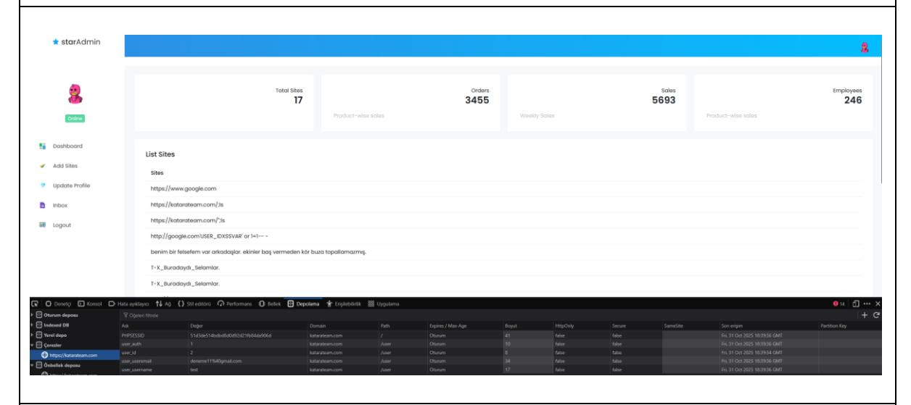
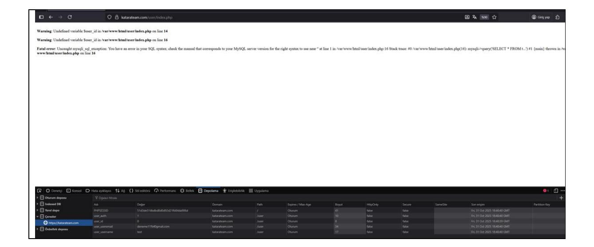
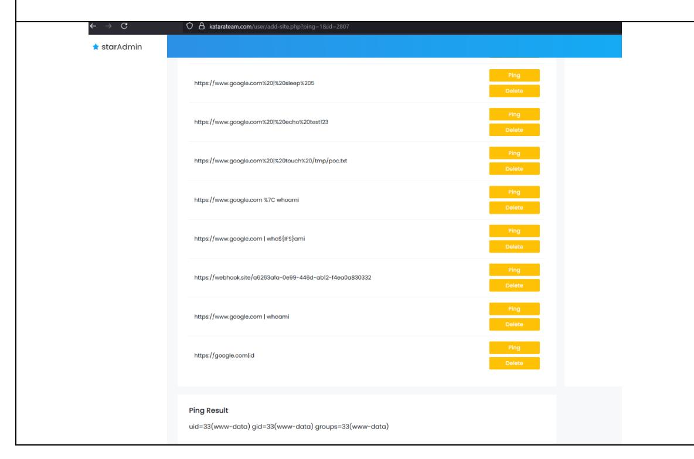
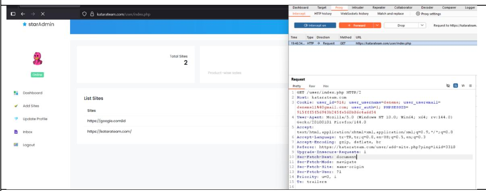
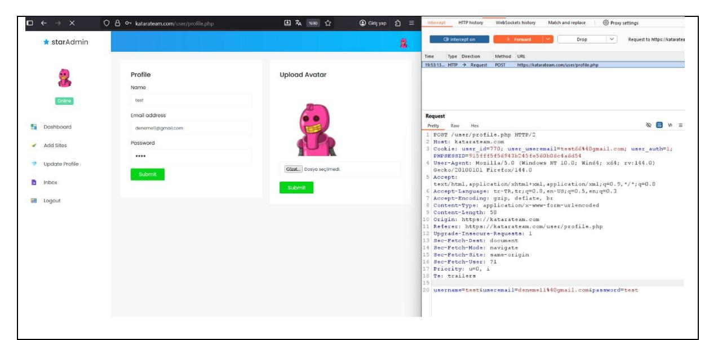
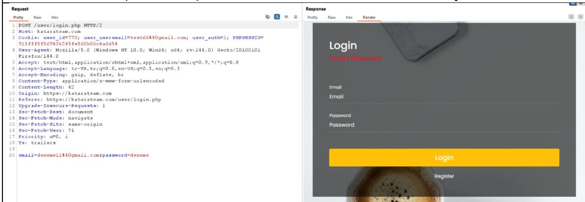
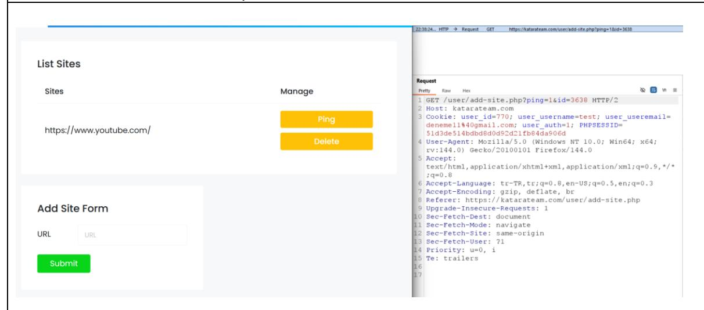
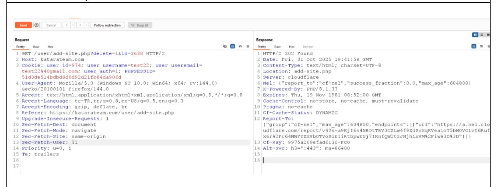
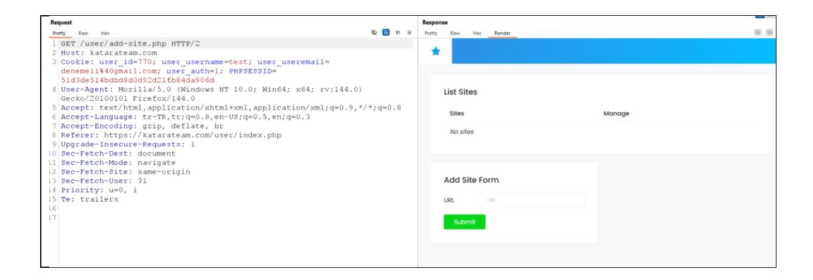
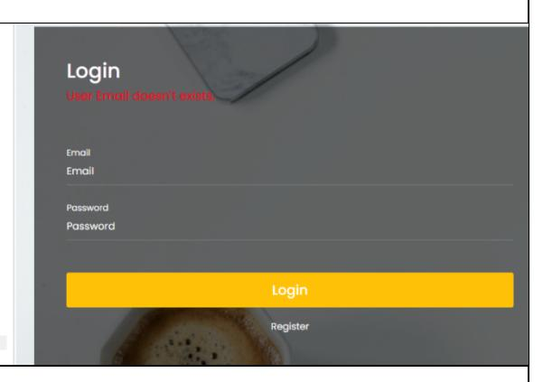

# **YAVUZLAR KATARATEAM SİTESİ PENTEST RAPORU**

**İsim: Mustafa Talha DOĞAN**

**Takım: Yavuzlar 16**

#### **UYARI**

Bu belge, Yavuzlar Web Güvenliği Eğitim Programı kapsamında, tamamen eğitim ve öğrenim amacıyla hazırlanmış bir penetrasyon testi sonuç raporudur. İçerik, testin yapıldığı anı yansıtmakta olup, hatalar veya eksik değerlendirmeler içerebilir.

Bu rapor, Mustafa Talha DOĞAN (Yavuzlar 16) tarafından, https://katarateam.com/ adresinde bulunan web platformu projesine karşı, görev tanımında belirtilen kurallar çerçevesinde yazılmıştır. Burada yapılanların herhangi bir yasal yükümlülüğü bulunmamaktadır.

# İçindekiler

| YÖNETİCİ ÖZETİ                                           | 3  |
|----------------------------------------------------------|----|
| RAPORLAMA VE METODOLOJİ                                  | 4  |
| KAPSAM                                                   | 4  |
| TEST METODOLOJISI                                        | 4  |
| RİSK DEĞERLENDİRMESİ                                     | 5  |
| ZAFİYET BULGULARI VE DETAYLARI                           | 6  |
| BULGU 01                                                 | 6  |
| Kırık Kimlik Doğrulama                                   | 6  |
| BULGU-02                                                 | 10 |
| İşletim Sistemi Komut Enjeksiyonu (OS Command Injection) | 10 |
| BULGU-03                                                 | 12 |
| SQL Enjeksiyonu                                          | 12 |
| BULGU-04                                                 | 15 |
| Kullanıcı Hesabını Kalıcı Olarak Kilitleme               | 15 |
| BULGU-05                                                 | 18 |
| Kırık Erişim Kontrolü (IDOR) ile Yetkisiz Veri Silme     | 18 |
| BULGU-06                                                 | 20 |
| Kullanıcı adı doğrulama ayrımı                           | 20 |

# **YÖNETİCİ ÖZETİ**

#### **YÖNETİCİ ÖZETİ**

Bu rapor, Mustafa Talha DOĞAN (Yavuzlar 16) tarafından, Yavuzlar Web Güvenliği Eğitim Programı görevi kapsamında, https://katarateam.com/ web uygulaması üzerinde gerçekleştirilen penetrasyon testi (sızma testi) sonuçlarını özetlemektedir.

Gerçekleştirilen testler sonucunda, uygulamanın genel güvenlik duruşunun KRİTİK seviyede olduğu değerlendirilmiştir.

Testler sırasında, uygulamanın hem altyapısal hem de iş mantığı katmanlarında, bir saldırganın sistem üzerinde tam yetki elde etmesine olanak tanıyacak çok sayıda ciddi güvenlik zafiyeti tespit edilmiştir. Toplam 6 adet zafiyet raporlanmış olup, bu bulguların 1 tanesi Kritik, 2 tanesi Yüksek ve 1 tanesi Orta seviyededir.

En kritik bulgularımız özetle:

- 1. **Uzaktan Kod Çalıştırma (RCE):** Uygulamanın add-site.php bölümünde, sunucunun güvenlik filtrelerini atlatarak temel işletim sisteminde komut çalıştırmamıza izin veren kritik bir zafiyet tespit edilmiştir (KT-RCE-01).
- 2. **SQL Enjeksiyonu (SQLi):** login.php (giriş formu) ve inbox.php (mesajlaşma) gibi birden fazla kritik bileşenin, veri tabanı sorgularına karşı savunmasız olduğu kanıtlanmıştır (KT-SQLI-01).
- 3. **Kırık Kimlik Doğrulama:** Uygulamanın, kullanıcı kimliğini doğrulamak için güvenli oturum (PHPSESSID) yerine, tarayıcıda kolayca değiştirilebilen user\_id çerezine güvendiği ortaya çıkarılmıştır (KT-AUTH-01).

Bu üç zafiyetin bir arada değerlendirilmesi, kötü niyetli bir saldırganın şu senaryoları gerçekleştirebileceği anlamına gelmektedir:

- **Tam Veri Tabanı Sızıntısı:** users tablosundaki tüm kullanıcıların kişisel bilgilerini, şifrelerini ve tüm özel mesajları çalabilir.
- **Sunucunun Ele Geçirilmesi:** Sunucuya bir arka kapı yerleştirerek tüm uygulama dosyalarını değiştirebilir, silebilir veya siteye giren diğer kullanıcılara zararlı yazılım bulaştırabilir.
- **Toplu Hesap Devralma:** user\_id çerezini (1, 2, 3...) değiştirerek sistemdeki tüm kullanıcıların hesaplarını saniyeler içinde ele geçirebilir.

Raporun "Zafiyet Bulguları ve Detayları" bölümünde, tespit edilen her bir zafiyet için ayrıntılı teknik analiz ve bu riskleri ortadan kaldıracak "Çözüm Önerileri" sunulmuştur.

# **RAPORLAMA VE METODOLOJİ**

#### **KAPSAM**

Bu penetrasyon testi, https://katarateam.com/ adresinde çalışan web uygulamasının tamamını hedef almıştır.

#### **Kapsam İçi (In-Scope)**

- **Hedef URL:** https://katarateam.com/ adresindeki tüm sayfalar ve fonksiyonlar.
- **Test Türü:** Manuel web uygulama güvenlik testi, uygulama mantık hataları, kimlik doğrulama ve yetkilendirme zafiyetlerinin analizi.

#### **Kapsam Dışı (Out-of-Scope)**

Görev tanımındaki kısıtlamalara ve standart penetrasyon testi kurallarına bağlı olarak aşağıdaki aktiviteler kesinlikle kapsam dışında bırakılmıştır:

- Hizmet Reddi (Denial of Service DoS/DDoS) saldırıları.
- login/register formları üzerinde kaba kuvvet (Brute Force) saldırıları.
- Otomatik araçlarla dizin taraması (Directory Busting / Fuzzing).
- Sunucunun stabilitesini bozabilecek veya diğer katılımcıları etkileyebilecek herhangi bir yıkıcı (destructive) test.
- Sosyal mühendislik ve fiziksel güvenlik testleri.

### **TEST METODOLOJİSİ**

Bu penetrasyon testi, https://katarateam.com/ uygulamasının kaynak kodlarına (sunucu tarafı) herhangi bir erişim sağlanmadan gerçekleştirilmiştir.

Test, iki aşamalı bir metodoloji izlemiştir:

#### **1. Siyah Kutu (Black-Box) Metodolojisi:**

- o Testin ilk aşamasında, uygulamaya kimlik doğrulaması yapılmamış bir saldırgan gözüyle yaklaşılmıştır.
- o Ana sayfa, /page.php gibi genel sayfalar ve /user/login.php, /user/register.php gibi kimlik doğrulama formları üzerinde analizler yapılmıştır.

#### 2. **Gri Kutu (Gray-Box) Metodolojisi:**

o Uygulama üzerinde standart bir kullanıcı hesabı oluşturulduktan sonra, kimlik doğrulaması yapılmış bir kullanıcı gözüyle testlere devam edilmiştir.

# **RİSK DEĞERLENDİRMESİ**

#### **CVSS Nedir ve Nasıl Çalışır**

Bu rapordaki bulguların teknik ciddiyetini ölçmek için, endüstri standardı olan CVSS (Common Vulnerability Scoring System) esas alınmıştır. CVSS, her bir zafiyetin şiddetini 0.0 ile 10.0 arasında sayısal bir puanla ifade eden açık kaynaklı bir sistemdir. Bu puanlama, bir zafiyetin ne kadar kolay istismar edilebileceğini ve başarılı bir saldırının etkisini objektif bir şekilde ölçer.

Bu değerlendirmede CVSS v3.1 standardı kullanılmıştır. Hesaplamalar, [Chandanbn CVSS](https://chandanbn.github.io/cvss/)  [Calculator](https://chandanbn.github.io/cvss/) aracı üzerinden yapılmıştır. CVSS v3.1, her zafiyeti sekiz temel metrik (Attack Vector, Attack Complexity, Privileges Required, User Interaction, Scope, Confidentiality, Integrity, Availability) üzerinden değerlendirir ve bu metriklerin kombinasyonu sonucunda Base Score üretilir.

Balbix CVSS rehberine göre, bu puan yalnızca bir zafiyetin şiddet derecesini temsil eder; organizasyonel risk düzeyi ise sistemin önemi, varlık değeri, tehdit ortamı ve mevcut güvenlik önlemleri gibi çevresel faktörlere göre değişebilir. Dolayısıyla CVSS, teknik ciddiyet ölçümünde referans olarak alınmış; ancak nihai risk değerlendirmesi, sistem bağlamında yorumlanmıştır.

#### **Referanslar**

*[https://www.balbix.com/insights/understanding-cvss](https://www.balbix.com/insights/understanding-cvss-scores/#:~:text=CVSS%20scoring%20assigns%20a%20number,characteristics%20may%20change%20over%20time)[scores/#:~:text=CVSS%20scoring%20assigns%20a%20number,characteristics](https://www.balbix.com/insights/understanding-cvss-scores/#:~:text=CVSS%20scoring%20assigns%20a%20number,characteristics%20may%20change%20over%20time) [%20may%20change%20over%20time.](https://www.balbix.com/insights/understanding-cvss-scores/#:~:text=CVSS%20scoring%20assigns%20a%20number,characteristics%20may%20change%20over%20time)*

<https://chandanbn.github.io/cvss/>

#### **CVSS Puan Aralıkları ve Risk Seviyeleri**

| Seviye               | CVSS Puan Aralığı | Açıklama ve Proje Özelinde Örnekler                                                                                                                                                                                                                                                                                     |  |
|----------------------|-------------------|-------------------------------------------------------------------------------------------------------------------------------------------------------------------------------------------------------------------------------------------------------------------------------------------------------------------------|--|
| KRİTİK (Critical) | 9.0 – 10.0     | Sunucu Yanıyor Uzaktan, herhangi bir ayrıcalık veya kullanıcı etkileşimi gerektirmeden istismar edilebilen zafiyetlerdir. Sistemin tamamının ele geçirilmesine (RCE), veritabanı sızmasına veya geri dönülemez veri kaybına yol açabilir.                                        |  |
| YÜKSEK (High)     | 7.0 - 8.9      | Kilitli Kapıları Açmak Genellikle bir kullanıcının oturumunu ele geçirmeye veya başka bir kullanıcının/firmanın verilerini görmeye veya değiştirmeye (IDOR) olanak tanıyan zafiyetler.                                                                                                          |  |
| ORTA                 | 4.0 - 6.9      | Kapıyı Aralıklı Bırakmak Saldırganın işini kolaylaştıran, sisteme veya kullanıcılara dair bilgi sızdıran veya en iyi güvenlik pratiklerine (best practices) uyulmamasından kaynaklanan zafiyetler. Genellikle tek başına yıkıcı değildir ancak başka bir zafiyetle birleştirilerek (chained) kullanılır. |  |
| DÜŞÜK                | 0.1 - 3.9      | Kozmetik Güvenlik Etkisi düşük, istismarı çok zor olan veya uygulamanın doğrudan güvenliğini (gizlilik, bütünlük, erişilebilirlik) etkilemeyen yapılandırma eksiklikleri ve en iyi pratiklerin (best practices) ihlalleri.                                                                      |  |
| NONE                 | 0.0               | Aktif bir güvenlik riski oluşturmaz; yalnızca bilgilendirme amaçlıdır.                                                                                                                                                                                                                                               |  |

# **ZAFİYET BULGULARI VE DETAYLARI**

# **BULGU 01**

| Bulgu Adı              |                 |                                              |
|------------------------|-----------------|----------------------------------------------|
| Kırık Kimlik Doğrulama |                 |                                              |
| Bulgu Kodu             |                 |                                              |
| KT-AUTH-01             |                 |                                              |
| Önem Derecesi          | CVSS            | Vektor String                                |
| High                   | 8.8  High | CVSS:3.1/AV:N/AC:L/PR:L/UI:N/S:U/C:H/I:H/A:H |
| Erişim Noktası         |                 | Kullanıcı Profili                            |
| HTTP                   |                 | User (Kullanıcı)                          |

#### **Zafiyetin Etkisi**

#### **Confidentiality (C): High**

Zafiyet, bir saldırganın, user\_id çerezini değiştirerek ID'sini bildiği veya tahmin ettiği (örn: 1, 2, 3...) tüm kullanıcıların hesaplarını tam olarak devralmasına olanak tanır. Bu, tüm özel mesajlara ve kişisel verilere tam erişim anlamına gelir.

#### **Integrity (I): High**

Saldırgan, ele geçirdiği hesaplar adına tam yetkiyle (mesaj gönderme, url silme, şifre değiştirme) hareket edebilir.

#### **Availability (A): High**

Saldırgan, ele geçirdiği hesapları silerek veya şifrelerini değiştirerek meşru sahiplerini kalıcı olarak sistemden kilitleyebilir.

#### **Olası Kötüye Kullanım Senaryoları:**

• Toplu Hesap Devralma: Bir saldırgan, user\_id çerezini 1'den başlayarak artıran basit bir betik (script) ile sistemdeki tüm kullanıcıların hesaplarına sırayla giriş yapabilir, verilerini çalabilir ve hesaplarını kilitleyebilir.

#### **Zaafiyetin Açıklaması**

Uygulamanın oturum yönetimi mekanizması, kullanıcı kimliğini doğrulamak için PHPSESSID gibi güvenli, sunucu taraflı oturum kimlikleri yerine, istemci (tarayıcı) tarafından sağlanan user\_id çerezine güvenmektedir.

Güvenli bir uygulamada, sunucu *sadece* PHPSESSID'yi almalı ve bu oturum hangi kullanıcıya ait sorusunun cevabını kendi \$\_SESSION verisinden bulmalıdır.

Bu uygulamada ise sunucu, kullanıcıdan gelen user\_id çerezini hiçbir doğrulama veya temizleme (sanitization) yapmadan kabul etmekte ve doğrudan SQL sorgularında kullanmaktadır.

Bu zafiyetin iki kanıtı vardır:

- 1. **Hesap Devralma:** user\_id çerezi, geçerli başka bir kullanıcının ID'si (örn: 2) ile değiştirildiğinde, uygulama sayfayı yenileyince bizi o kullanıcının (user\_id=2) oturumuna sokmaktadır.
- 2. **SQL Hatası:** user\_id çerezi 0 veya abc gibi geçersiz bir değerle değiştirildiğinde, index.php betiği bu değeri doğrudan SQL sorgusuna (... WHERE user\_id = '') yerleştirmeye çalışmakta ve Fatal error: ... mysqli\_sql\_exception hatası vererek çökmektedir. Bu, değerin körü körüne güvenildiğini kanıtlar.

### **Tetiklenme / Reproduce Adımları**

Standart bir kullanıcı (örn: test, user\_id=770) olarak sisteme giriş yapılır.

Tarayıcıda F12 (Geliştirici Araçları) açılarak Depolama (Storage/Application) sekmesine gidilir.

Çerezler (Cookies) bölümünde katarateam.com sitesi seçilir.

user\_id değeri, başka bir geçerli kullanıcı ID'si olarak değiştirilir.Ve sayfa yenilenir.

Sayfa, user\_id=2 olan kullanıcının paneli (inbox vs.) olarak yüklenir. Hesap başarıyla devralınmıştır.

*Ek olarak:* Değer 0 olarak değiştirilip sayfa yenilendiğinde, ekran görüntüsündeki Fatal error ... mysqli\_sql\_exception hatası alınır.

**Güvenli Oturum Yönetimi:** user\_id çerezini kullanmak tamamen bırakılmalıdır.

Kullanıcı login.php'de başarıyla giriş yaptığında, user\_id *sadece* sunucu taraflı oturuma (session) yazılmalıdır:

index.php, inbox.php gibi diğer tüm sayfalarda, user\_id çerezden (\$\_COOKIE) değil, bu güvenli oturumdan (\$\_SESSION) okunmalıdır

#### **Referanslar**

[https://www.w3schools.com/php/php\\_sessions.asp](https://www.w3schools.com/php/php_sessions.asp)

<https://www.php.net/manual/en/reserved.variables.session.php>

#### **BULGU-02**

| Bulgu Adı                                                |             |                                              |
|----------------------------------------------------------|-------------|----------------------------------------------|
| İşletim Sistemi Komut Enjeksiyonu (OS Command Injection) |             |                                              |
| Bulgu Kodu                                               |             |                                              |
| KT-RCE-01                                                |             |                                              |
| Önem Derecesi                                            | CVSS        | Vektor String                                |
| High                                                     | 8.1 High | CVSS:3.1/AV:N/AC:L/PR:L/UI:N/S:U/C:H/I:H/A:N |
| Erişim Noktası                                           |             | Kullanıcı Profili                            |
| HTTP                                                     |             | User (Kullanıcı)                          |

### **Bulgunun Tespit Edildiği Bileşen/Bileşenler**

<https://katarateam.com/user/add-site.php>

#### **Zafiyetin Etkisi**

#### **Confidentiality (C): High**

Zafiyet, web sunucusu (www-data) yetkileriyle komut yürütmeye olanak tanıyabilir. Bu durumda saldırgan uygulama dizininde yer alan kaynak kodları, yapılandırma dosyaları veya kimlik bilgileri gibi hassas verilere erişim sağlayabilir. Bu durum, bilgi sızmasına ve sistemin iç yapısının ifşa olmasına yol açabilir.

#### **Integrity (I): High**

Zafiyetin doğrudan etkisi olmasa da, eğer komut enjeksiyonu genişletilebilirse saldırgan web uygulamasının dosyalarını veya veritabanı kayıtlarını manipüle edebilir. Bu, uygulamanın güvenilirliğini ve finansal işlem bütünlüğünü tehlikeye sokabilir.

#### **Availability (A): None**

Yapılan testler sırasında görev kurallarına uyularak (brute-force, yoğun tarama ve sistemi olumsuz etkileyecek komutlar **özellikle** denenmemiştir). Bu yüzden testlerimizde hizmet kesintisi veya erişilemezlik yaratan bir etki gözlemlenmemiştir. Ancak karakter filtreleri/engellemeler aşılarak veya farklı bypass teknikleri kullanılarak saldırganın sistem kaynaklarını tüketmesi veya servis süreçlerini etkilemesi mümkün olabilir. Mevcut manuel testler ışığında bu bulgu için **Availability = None** olarak değerlendirme yapılmıştır; tam doğrulama ve saldırı senaryosu analizi için staging ortamında kontrollü testler önerilir.

#### **Olası Kötüye Kullanım Senaryoları**

- Kısıtlamaların atlatılması durumunda, saldırgan uygulama üzerinden sunucu dosya sistemi üzerinde okuma/yazma işlemleri gerçekleştirebilir..
- Bu zafiyet, başka açıklarla birleştirilerek tam sistem ele geçirme veya kalıcı arka kapı oluşturma amacıyla kötüye kullanılabilir.

### **Zaafiyetin Açıklaması**

Uygulamanın Add Site panelindeki ping fonksiyonu, kullanıcı tarafından sağlanan URL girdisini alıp arka planda bir işletim sistemi komutu (ping) içinde çalıştırmaktadır.

Sunucu, bu girdiyi çalıştırmadan önce güvenlik filtrelerinden geçirmeye çalışmaktadır. Testlerimiz, ; (noktalı virgül), ls komutu ve boşluk gibi bilinen tehlikeli karakterlerin başarılı bir şekilde engellendiğini göstermiştir.

Ancak, bu filtreleme mekanizması eksiktir ve | (pipe) shell metakarakterini engellemeyi unutmuştur. Ayrıca, whoami ve id gibi komutlar da blockliste dahil edilmemiştir.

Bu eksiklik, bir saldırganın ping komutunun çıktısını | (pipe) karakteri aracılığıyla ikinci, zararlı bir komuta (id gibi) yönlendirmesine olanak tanır. Sonuç olarak, sunucunun güvenlik filtresi atlatılır ve www-data kullanıcısı bağlamında Uzaktan Kod Çalıştırma (RCE) zafiyetini tetikleyebilir.

### **Tetiklenme / Reproduce Adımları**

Kimlik doğrulaması yapılmış bir kullanıcı ile<https://katarateam.com/user/login.php> paneline giriş yapılır.

<https://katarateam.com/user/add-site.php> sayfasına gidilir.

Add Site Form altındaki URL giriş alanına https://www.google.com|id bu tarzda bir payload girilir.

Submit butonuna basılarak form gönderilir.

List Sites tablosunda oluşan https://google.com|id satırındaki Ping butonuna tıklanır.

Sayfanın alt kısmında Ping Result bölümünün çıktısı incelenir.

SONUÇ: Ekrana, ping komutunun hatasıyla birlikte, id komutunun çıktısı olan uid=33(www-data) gid=33(www-data) groups=33(www-data) metninin basıldığı görülür. Bu, komutun sunucuda başarıyla çalıştığını kanıtlar.

**Komut Enjeksiyonunu Engelleme:** Kullanıcıdan alınan girdi (url) işletim sistemi komutlarına asla doğrudan birleştirilmemelidir. Girdi, PHP'nin escapeshellarg() fonksiyonundan geçirilmelidir. Bu fonksiyon, girdiyi tek tırnak içine alır ve |, &, ; gibi tüm shell metakarakterlerinin komut olarak değil, ping komutuna bir argüman olarak algılanmasını sağlar.

**Whitelist Yaklaşımı:** ping fonksiyonu sadece geçerli alan adları (domain names) ve IP adresleri için çalışmalıdır. Girdiyi filter\_var(\$url\_input, FILTER\_VALIDATE\_DOMAIN, FILTER\_FLAG\_HOSTNAME) veya filter\_var(\$url\_input, FILTER\_VALIDATE\_IP) gibi PHP fonksiyonlarıyla doğrulayarak, |id gibi geçersiz girdilerin işleme alınması en başından engellenmelidir.

**Alternatif Çözüm (Shell'den Kaçınma):** system() veya shell\_exec() gibi tehlikeli PHP fonksiyonlarını kullanmak yerine, ping işlemini doğrudan PHP içinde (shell'e çıkmadan) gerçekleştiren harici bir kütüphane (örn: pear/Net\_Ping) kullanmak tercih edilmelidir.

| Referanslar                                               |  |  |
|-----------------------------------------------------------|--|--|
| https://cwe.mitre.org/data/definitions/78.html            |  |  |
| https://www.php.net/manual/en/function.escapeshellarg.php |  |  |

### **BULGU-03**

| Bulgu Adı       |                 |                                              |
|-----------------|-----------------|----------------------------------------------|
| SQL Enjeksiyonu |                 |                                              |
| Bulgu Kodu      |                 |                                              |
| KT-SQLI-01      |                 |                                              |
| Önem Derecesi   | CVSS            | Vektor String                                |
| Critical        | 9.8 Critical | CVSS:3.1/AV:N/AC:L/PR:N/UI:N/S:U/C:H/I:H/A:H |
| Erişim Noktası  |                 | Kullanıcı Profili                            |
| HTTP            |                 | Anonim                                       |

| Bulgunun Tespit Edildiği Bileşen/Bileşenler |  |  |  |
|---------------------------------------------|--|--|--|
| https://katarateam.com/user/login.php       |  |  |  |
| https://katarateam.com/user/inbox.php       |  |  |  |

### **Zafiyetin Etkisi**

**Confidentiality (C): High —** Zafiyet, login.php üzerinden kimlik doğrulamasız bir saldırganın tüm veri tabanını (kullanıcı adları, e-postalar, şifre hash'leri, özel mesajlar) okumasına olanak tanır.

**Integrity (I): High —** Saldırgan, veri tabanındaki tüm verileri değiştirebilir veya silebilir .

**Availability (A): High —** Saldırgan, DROP TABLE komutları ile uygulamanın kritik tablolarını silerek sitenin tamamının hizmet vermesini engelleyebilir.

**Kimlik Doğrulama Atlama ve Veri Bütünlüğünü Bozma**: Özel olarak hazırlanmış bu test yükleri, password kontrolünü bypass (atlatmak) veya UPDATE/DELETE komutlarını tetiklemek için de kullanılabilir. Bu durum, yetkisiz hesap girişi, toplu veri silme veya sitenin hizmet dışı bırakılması risklerini doğurur.

### **Zaafiyetin Açıklaması**

Uygulamanın login.php (kimlik doğrulamasız) ve inbox.php (kimlik doğrulamalı) sayfaları, kullanıcıdan alınan girdileri (sırasıyla email ve Message parametreleri) güvenli hale getirmeden doğrudan SQL sorgularına birleştirmektedir.

Uygulama, bu girdileri filtrelemek için Parametreli Sorgular (Prepared Statements) kullanmamaktadır. Sonuç olarak, saldırganın gönderdiği tek tırnak (') karakteri, sunucudaki SELECT \* FROM t... (login sorgusu) veya INSERT INTO tbl... (mesaj sorgusu) sorgularının yapısını bozmaktadır.

Sunucunun, bu bozuk sorguya yanıt olarak Fatal error: Uncaught mysqli\_sql\_exception şeklinde detaylı bir hata mesajı döndürmesi, zafiyetin varlığını tartışmasız bir şekilde kanıtlamakta ve saldırgana zafiyetin "Hata Tabanlı" (Error-Based) olduğunu ifşa etmektedir.

# **Tetiklenme / Reproduce Adımları**

Zafiyetin tetiklenmesi için en net yol olan login.php kullanılmıştır.

Burp Suite gibi bir proxy aracı ile https://katarateam.com/user/login.php adresine bir POST isteği hazırlanır.

password parametresine herhangi bir değer girilir.

email parametresine, geçerli bir e-postanın sonuna tek tırnak (') eklenerek şu test yükü girilir:

ÖRNEK:

deneme15@gmail.com'

İstek sunucuya gönderilir.

Sunucu, HTTP 200 OK yanıtı döner ancak sayfanın gövdesinde (body) Fatal error: ... mysqli\_sql\_exception ... near '''' at line 1 ... /var/www/html/user/login.php on line 16 hatası açıkça görülür. Bu hata, enjeksiyonun başarılı olduğunun kanıtıdır.

**Prepared Statements Kullanımı:** Uygulamadaki mysqli->query() gibi doğrudan sorgu çalıştıran tüm fonksiyonlar Parametreli Sorgular (Prepared Statements) ile değiştirilmelidir. Bu yöntem, kullanıcı girdisini (') bir SQL komutu olarak değil, sorgulanacak bir metin parçası olarak ele alır ve SQL Enjeksiyonu'nu %100 engeller.

PHP yapılandırmasında (php.ini) display\_errors direktifi Off olarak ayarlanmalıdır. Bu, zafiyeti düzeltmez ancak saldırganın Fatal error gibi detaylı hata mesajlarını görmesini engelleyerek saldırıyı "Hata Tabanlı"dan "Kör" (Blind) seviyeye indirger ve zorlaştırır.

#### **Referanslar**

<https://cwe.mitre.org/data/definitions/89.html>

<https://www.php.net/manual/en/mysqli.prepare.php>

### **BULGU-04**

| Bulgu Adı                                  |             |                                              |  |
|--------------------------------------------|-------------|----------------------------------------------|--|
| Kullanıcı Hesabını Kalıcı Olarak Kilitleme |             |                                              |  |
| Bulgu Kodu                                 |             |                                              |  |
| KT-LOGIC-01                                |             |                                              |  |
| Önem Derecesi                              | CVSS        | Vektor String                                |  |
| High                                       | 7.1 High | CVSS:3.1/AV:N/AC:L/PR:L/UI:N/S:U/C:N/I:L/A:H |  |
| Erişim Noktası                             |             | Kullanıcı Profili                            |  |
| HTTP                                       |             | User                                         |  |

| Bulgunun Tespit Edildiği Bileşen/Bileşenler |  |  |  |  |  |  |
|---------------------------------------------|--|--|--|--|--|--|
|---------------------------------------------|--|--|--|--|--|--|

https://katarateam.com/user/profile.php https://katarateam.com/user/login.php

#### **Zafiyetin Etkisi**

**Confidentiality (C): None —** Zafiyet, saldırganın kurbanın verilerini okumasına izin vermez. **Integrity (I): Low —** Zafiyet, kimlik doğrulama sisteminin mantıksal bütünlüğünü bozarak, meşru bir kullanıcının kendi hesabıyla eşleşmesini engeller.

**Availability (A): High —** Zafiyet, bir saldırganın, e-posta adresini bildiği herhangi bir kurban kullanıcıyı platformdan kalıcı olarak kilitlemesine olanak tanır. Kurban, kendi doğru e-posta ve şifresini girse bile hesabına bir daha erişemez.

#### **Olası Kötüye Kullanım Senaryoları:**

- **Hedefli Hizmet Reddi:** Bir saldırgan ,e-posta adresini bildiği herhangi bir kurban kullanıcıyı , kendi e-posta adresini kurbanınkiyle güncelleyerek platformdan kalıcı olarak kilitleyebilir.
- **Yönetici Hesabını Kilitleme:** En kritik senaryo, saldırganın bir admin@katarateam.com gibi bir yönetici e-postasını öğrenmesidir. Saldırgan, bu epostayı kendi profiline tanımlayarak yöneticinin siteye girişini kalıcı olarak engelleyebilir ve sitenin yönetimsel işlevlerini durma noktasına getirebilir.

### **Zaafiyetin Açıklaması**

Bu, kritik bir iş mantığı (business logic) zafiyetidir. profile.php betiği, bir kullanıcının e-posta adresini güncellerken, girilen yeni e-posta adresinin (useremail parametresi) veri tabanında zaten başka bir kullanıcı tarafından kullanılıp kullanılmadığını kontrol etmemektedir. Bu benzersizlik (uniqueness) kontrolünün eksikliği nedeniyle, iki farklı kullanıcı (örn: test66 ve deneme11) aynı e-posta adresine (deneme11@gmail.com) sahip olabilmektedir.

Uygulamanın login.php betiği ise deneme11@gmail.com e-postasıyla giriş yapılmaya çalışıldığında, veri tabanından (muhtemelen en son güncellenen) test66 kullanıcısının kaydını bulur. Kurban (deneme11) kendi *doğru şifresini* girdiğinde, login.php bu şifreyi test66'nın *yanlış şifre hash'i* ile karşılaştırır ve Invalid Password hatası döndürür. Sonuç olarak, kurban kendi hesabına erişimini kalıcı olarak kaybeder.

### **Tetiklenme / Reproduce Adımları**

**Kurban Hesap:** deneme11@gmail.com e-postası ve deneme şifresiyle yeni bir "Kurban" hesap oluşturulur.

**Saldırı:** "Saldırgan" (test66) olarak oturum açılır ve profile.php sayfasına gidilir.

Email address alanı, "Kurban" hesabın e-postası olan deneme11@gmail.com olarak değiştirilir ve "Submit" edilir. Sistem bu değişikliği kabul eder.

Tüm oturumlardan çıkış yapılır .

login.php sayfasına gidilir.

Kurbanın kendi doğru bilgileriyle giriş yapılmaya çalışılır:

- E-posta: deneme11@gmail.com
- Şifre: deneme

Ekran görüntülerinde kanıtlandığı gibi, sistem Invalid Password (Geçersiz Şifre) hatası döndürür. Kurban (deneme11) kendi hesabından kalıcı olarak kilitlenmiştir.

# **Çözüm Önerileri**

**Veri Tabanı Seviyesi:** En güçlü ve kalıcı çözüm, users tablosundaki email kolonuna UNIQUE kısıtlaması eklemektir.

**Uygulama Seviyesi**: profile.php betiği, UPDATE işlemi yapmadan önce, yeni e-postanın başka bir kullanıcıya (mevcut user\_id dışında) ait olup olmadığını kontrol etmelidir.

#### **Referanslar**

[https://owasp.org/Top10/A07\\_2021-Identification\\_and\\_Authentication\\_Failures/](https://owasp.org/Top10/A07_2021-Identification_and_Authentication_Failures/) <https://cwe.mitre.org/data/definitions/840.html>

### **BULGU-05**

| Bulgu Adı                                            |             |                                              |  |
|------------------------------------------------------|-------------|----------------------------------------------|--|
| Kırık Erişim Kontrolü (IDOR) ile Yetkisiz Veri Silme |             |                                              |  |
| Bulgu Kodu                                           |             |                                              |  |
| KT-LOGIC-01                                          |             |                                              |  |
| Önem Derecesi                                        | CVSS        | Vektor String                                |  |
| High                                                 | 7.1 High | CVSS:3.1/AV:N/AC:L/PR:L/UI:N/S:U/C:N/I:H/A:L |  |
| Erişim Noktası                                       |             | Kullanıcı Profili                            |  |
| HTTP                                                 |             | User                                         |  |

#### **Bulgunun Tespit Edildiği Bileşen/Bileşenler**

https://katarateam.com/user/add-site.php(delete ve ping parametreleri)

### **Zafiyetin Etkisi**

**Confidentiality (C): None —** Birincil etki veri sızıntısı değildir.

**Integrity (I): High —** Zafiyet, bir saldırganın, yetkili bir kullanıcı gibi davranarak, diğer kullanıcılara ait site kayıtlarını kalıcı olarak silmesine olanak tanır.

**Availability (A): Low —** Saldırgan, basit bir betik (script) ile tüm id'leri tarayarak veri tabanındaki tüm site kayıtlarını silebilir. Bu, uygulamanın bu özelliğini tüm kullanıcılar için tamamen kullanılamaz hale getirir.

#### **Olası Kötüye Kullanım Senaryoları:**

• **Toplu Veri İmhası:** Bir saldırgan, GET /user/add-site.php?delete=1&id=[ID] isteğindeki [ID] numarasını 1'den başlayarak artıran bir döngüye sokar. Bu betik, dakikalar içinde tbl\_sites tablosundaki tüm verileri kalıcı olarak silebilir.

### **Zaafiyetin Açıklaması**

Uygulamanın "List Sites" panelinde, Delete (Sil) ve Ping (Ping at) fonksiyonları, hangi sitenin hedefleneceğini belirlemek için id adlı bir GET parametresi kullanmaktadır.

Sunucu (add-site.php betiği), bu delete veya ping isteğini aldığında, Bu isteği yapan kullanıcı ,silinmesi istenen id'li sitenin sahibi mi? diye bir yetkilendirme kontrolü yapmamaktadır.

Sunucu, sadece isteği yapanın *herhangi bir* geçerli kullanıcı olup olmadığına bakmakta, ancak o kullanıcının *sadece kendi kaynakları* üzerinde işlem yapmasını zorunlu kılmamaktadır. Bu, bir kullanıcının basitçe URL'deki id numarasını değiştirerek tüm veri tabanındaki diğer kayıtlara müdahale etmesine izin veren klasik bir IDOR zafiyetidir.

#### **Tetiklenme / Reproduce Adımları**

**Kurban Hesap:** deneme11 kullanıcısıyla giriş yapılır ve<https://www.youtube.com/> adında bir site eklenir. Sunucu bu siteye id=3638 atar.

**Saldırgan Hesap:** test22 kullanıcısıyla (tamamen farklı bir hesap) giriş yapılır.

Saldırgan, add-site.php'de delete butonuna basarak burpsuite de post isteğini yakalar ve id kısmına 3638 yazınca test22 kullanıcısının listesinden 3638 id li url silinir.

Saldırgan, test22 kullanıcısı olmasına rağmen, deneme11 kullanıcısına ait olan id=3638 'li urli başarıyla siler.

**Sahiplik Kontrolü**: Sunucu, delete veya ping işlemini yapmadan hemen önce, o an oturum açmış kullanıcının (\$\_SESSION['user\_id']) silinmesi/ping'lenmesi istenen sitenin (\$\_GET['id']) sahibi olup olmadığını veri tabanından kontrol etmelidir.

### **Referanslar**

https://cwe.mitre.org/data/definitions/639.html

### **BULGU-06**

| Bulgu Adı                      |               |                                              |  |
|--------------------------------|---------------|----------------------------------------------|--|
| Kullanıcı adı doğrulama ayrımı |               |                                              |  |
| Bulgu Kodu                     |               |                                              |  |
| KT-INFO-01                     |               |                                              |  |
| Önem Derecesi                  | CVSS          | Vektor String                                |  |
| Medium                         | 5.3 Medium | CVSS:3.1/AV:N/AC:L/PR:N/UI:N/S:U/C:L/I:N/A:N |  |
| Erişim Noktası                 |               | Kullanıcı Profili                            |  |
| HTTP                           |               | Anonim                                       |  |

### **Bulgunun Tespit Edildiği Bileşen/Bileşenler**

https://katarateam.com/user/login.php

### **Zafiyetin Etkisi**

**Confidentiality (C): Low** — Zafiyet, bir saldırganın deneme yanılma yoluyla hangi e-posta adreslerinin platformda kayıtlı olduğunu ve hangilerinin olmadığını tespit etmesine olanak tanır. Bu, geçerli kullanıcıların bir listesinin oluşturulmasına yol açarak gizliliği ihlal eder.

**Olası Kötüye Kullanım Senaryoları:**

• Geçerli Kullanıcı Listesi Oluşturma: Bir saldırgan, otomatik bir betik (script) kullanarak login.php formuna binlerce e-posta adresi dener. Geçersiz Şifre yanıtı aldığı tüm epostaları "geçerli kullanıcı" olarak kaydeder.

### **Zaafiyetin Açıklaması**

Uygulamanın login.php sayfası, bir giriş denemesi başarısız olduğunda iki farklı hata mesajı döndürmektedir.

- 1. Sistemde kayıtlı olmayan bir e-posta adresi girildiğinde: Kullanıcı E-postası mevcut değil.
- 2. Sistemde kayıtlı olan bir e-posta adresi ancak yanlış şifre girildiğinde: Geçersiz Şifre Bu gözlemlenebilir fark (observable discrepancy), bir saldırgana "doğru/yanlış" oyunu oynama fırsatı verir. Saldırgan, sadece dönen hata mesajına bakarak girdiği e-postanın veri tabanında olup olmadığını net bir şekilde anlayabilir.

### **Tetiklenme / Reproduce Adımları**

#### **login.php sayfasına gidilir.**

#### **Deneme 1 (Mevcut Olmayan E-posta):**

• E-posta: test@gmail.com

• Şifre: test

• Ekranda Kullanıcı E-postası mevcut değil. hatası belirir.

#### **Deneme 2 (Mevcut Olan E-posta):**

• E-posta: deneme1@gmail.com

• Şifre: 123456

• Ekranda Geçersiz Şifre hatası belirir.

#### **Genel Hata Mesajı:**

login.php betiği, giriş denemesi neden başarısız olursa olsun (ister yanlış kullanıcı adı, ister yanlış şifre, isterse her ikisi birden), kullanıcıya her zaman aynı genel mesajı göstermelidir. "Kullanıcı adı veya şifre hatalı." Bu şekilde, saldırgan girdiği e-postanın geçerli olup olmadığını asla anlayamaz.

#### **Referanslar**

https://cwe.mitre.org/data/definitions/203.html